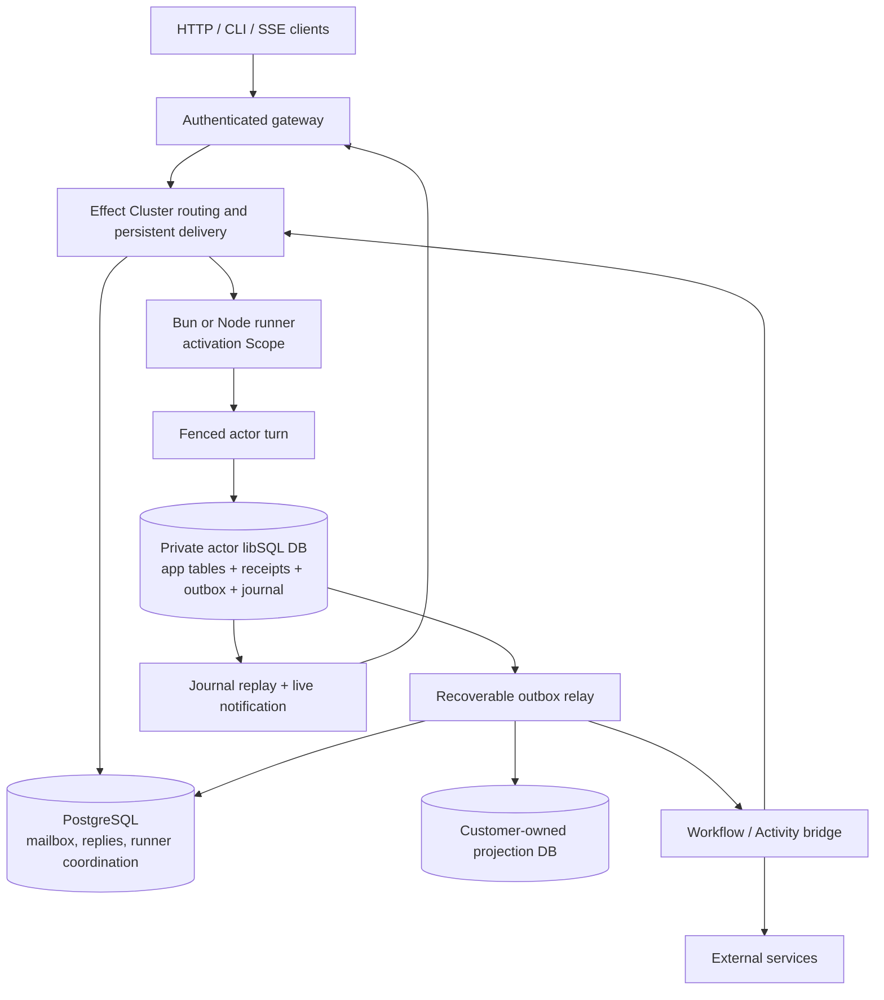

# Durable Actors — integrated research report

This consolidated report assembles the key standalone documents. The complete dossier includes additional engineering, provider, operational and ADR files indexed in docs/INDEX.md. All framework APIs are proposals; the repository is setup-only.

# Vision

Research date: 2026-09-17. Status: design specification, not implemented runtime behavior.

## The problem

Teams often assemble a database, request handlers, retry jobs, cron, websocket fan-out, caches and ownership rules around one long-lived resource. The same resource appears in multiple execution contexts and failure recovery is spread across them. Durable Actors should make that coordination boundary explicit without requiring a separate service deployment for each domain.

The first target is an Effect/TypeScript team building a control plane or collaborative stateful application: deployments, domains, build jobs, workspaces and support cases. An ordinary CRUD application with easy relational joins may be better served by shared PostgreSQL and ordinary services. We must make that tradeoff visible rather than sell actors as universally superior.

## Promise

Define an entity protocol and its behavior. Address an entity by stable identity. Give it actor-private relational state. Submit durable work, observe a retained result, and survive process replacement. The public programming model should remain the same in a local development environment, self-hosted deployment, or our managed service, subject to explicit capability and durability differences.

## What differentiates the product

The hypothesis is a coherent Effect-native programming model with excellent inspectability and safe relational projections—not a new actor concept and not a novel storage engine. Rivet already has actors and an Effect integration. Cloudflare already integrates execution and durable storage. Our advantage must be demonstrated by less integration code and better failure reasoning in actual applications.

## Non-promises

We do not promise exactly-once external effects, infinite scale for one actor, instant cold starts, zero cost per dormant identity, or unrestricted interchangeable storage engines. A projection is not a synchronous join against every actor. A durable identity does not preserve an arbitrary OS process, JavaScript stack, or in-memory fiber after a crash.

## Product sequence

Actor correctness kernel first; a useful HTTP/CLI example second; durable events and a narrow projection beta next. Managed single-tenant design-partner environments follow measured operations. Agents and a general multi-tenant code-hosting cloud are later products.

## Sources and evidence

- [E02: Effect Cluster entity example](https://github.com/Effect-TS/effect/blob/9ad9891e24058065bcd445772e005f8ce4b3e42f/ai-docs/src/80_cluster/10_entities.ts) — Messages are volatile unless persisted annotation is set; sequential handlers by default; activation-local Ref; maxIdleTime; typed clients.
- [C01: Rivet actor documentation](https://rivet.dev/docs/actors) — Closest general actor platform; current feature claims must come from docs, not blanket superiority claims.
- [C02: Rivet Effect SDK](https://rivet.dev/changelog/2026-06-16-introducing-the-effect-sdk/) — Effect integration means Effect-native alone is not differentiation.
- [C04: Cloudflare Durable Objects](https://developers.cloudflare.com/durable-objects/) — Runtime-owned identity/storage/lifecycle; use for architectural comparison.


---

# Product definition and customer experience

Research date: 2026-09-17. Status: design specification, not implemented runtime behavior.

## The first customer

Target a small TypeScript team already using Effect that owns a stateful control plane: deployment jobs, domains/certificates, device commands or collaborative workspaces. They need recoverable commands and realtime status more than unrestricted global joins. A good first design partner can describe an actual lost-work or race-condition incident and provide a representative workload for fault testing.

## First product, not three products

Ship an actor framework with a reference self-hosted deployment. Use that framework for one substantial reference application and a small managed pilot. Do not simultaneously launch a general queue service, workflow service, SQL engine, agent framework and global application cloud. The agent package remains a future consumer of the actor API.

## Developer journey

1. Define protocol and actor-local schema.
2. Implement small repositories/domain services and an actor Layer.
3. Test locally using the in-process adapter and deterministic clocks.
4. Test production semantics against real PostgreSQL/libSQL in a separate integration lane.
5. Deploy the application image with registered actor types.
6. Submit a command, receive a stable receipt, inspect its status and follow retained events.
7. Enable an explicit projected table only when global query requirements justify the pipeline.

## Managed offering

Initially manage one application/environment per dedicated runner deployment with shared provider infrastructure only where credential/isolation boundaries are proven. Customer code is untrusted relative to other customers; an Effect Scope is not a security sandbox. A broad multi-tenant code cloud is a later security project.

Manage routing, accepted-work tracking, actor database provisioning, upgrade orchestration and observability. Provide actor-namespaced object storage. Let the customer choose/own the global query DB. Optional managed projection databases can be added only with a clear tenancy/schema model.

## Product acceptance

The first success is not a benchmark headline. A customer must reproduce a killed-runner recovery, inspect exactly which command committed, retrieve a result after disconnect, and migrate an actor database without losing queued work. Measure time-to-first-success and recovery diagnosis time against their current codebase.

## What is not delivered by this skeleton

No working actor runtime, no automatic database provisioning, no cloud authentication flow, no SDK publication and no paid plans. Those are milestones with acceptance evidence. This package gives the contracts, scope, research, build/test/release scaffolding and decisions needed to implement them.

## Sources and evidence

- [C01: Rivet actor documentation](https://rivet.dev/docs/actors) — Closest general actor platform; current feature claims must come from docs, not blanket superiority claims.
- [C04: Cloudflare Durable Objects](https://developers.cloudflare.com/durable-objects/) — Runtime-owned identity/storage/lifecycle; use for architectural comparison.
- [E02: Effect Cluster entity example](https://github.com/Effect-TS/effect/blob/9ad9891e24058065bcd445772e005f8ce4b3e42f/ai-docs/src/80_cluster/10_entities.ts) — Messages are volatile unless persisted annotation is set; sequential handlers by default; activation-local Ref; maxIdleTime; typed clients.
- [T04: Turso Platform API](https://docs.turso.tech/api-reference/introduction) — Provisioning/control API is separate from SQL data-plane client.


---

# Engineering principles

Research date: 2026-09-17. Status: design specification, not implemented runtime behavior.

1. **Correctness before convenience.** An API may hide retry plumbing but must not hide whether a command is accepted, committed, externally executed, or merely projected.
2. **One actor is an ownership boundary, not necessarily one row.** Keep invariants and frequently transactional data together. Avoid one database per trivial row unless workload economics justify it.
3. **Definition, implementation, execution are separate.** Protocol/Schema values describe; Layers construct; Effects execute. Piping is an affordance, not a requirement to encode every option as a combinator.
4. **Build on Effect without confusing its guarantees.** Scope is resource lifetime, not persistence. Stream is computation, not a durable log. Schedule is a policy value, not a persisted timer. A driver transaction is limited to that database connection.
5. **Read facts at the right boundary.** Authoritative reads go to the actor's current primary-backed state; projections are explicitly eventual and may expose lag/watermarks.
6. **Make defaults opinionated.** Production standard: persistent commands, serialized mutations, short transactions, schema-versioned messages, bounded queues, explicit unsafe escape hatches. Adapters must preserve these contracts.
7. **No secret platform work at import time.** Database creation, migrations, clients, file access and subscriptions happen under acquired runtime scopes, not descriptor construction.
8. **Make operations inspectable.** Every accepted command needs a durable ID and retrievable outcome; every blocked job should have a reason and recovery action.
9. **Do not shift hidden costs onto customers.** Meter expensive writes, broadcasts, storage retention and reconnection replay. Idle compute may be released; storage and control-plane fleet costs remain.
10. **A scaffold is not an implementation.** Passing its typecheck/import tests proves only its setup. Production claims require failure evidence.

## Standard escape-hatch policy

Expose raw Effect SQL within actor storage, but reserve internal tables and prohibit transaction control that bypasses the turn. Custom schemas, repositories and capabilities are welcome. Changing the durability contract, using stale read replicas for authoritative decisions, or sending external actions before commit is unsupported in the standard runtime. Such code belongs behind an explicitly unsafe/advanced boundary and cannot retain the same guarantee label.

## Sources and evidence

- [E02: Effect Cluster entity example](https://github.com/Effect-TS/effect/blob/9ad9891e24058065bcd445772e005f8ce4b3e42f/ai-docs/src/80_cluster/10_entities.ts) — Messages are volatile unless persisted annotation is set; sequential handlers by default; activation-local Ref; maxIdleTime; typed clients.
- [E04: Cluster message persistence contract](https://github.com/Effect-TS/effect/blob/9ad9891e24058065bcd445772e005f8ce4b3e42f/packages/effect/src/unstable/cluster/MessageStorage.ts) — Shard-wide recovery queries, deduplication, replies and transaction wrapper; no cross-database transaction guarantee.
- [E05: Workflow Activity](https://github.com/Effect-TS/effect/blob/9ad9891e24058065bcd445772e005f8ce4b3e42f/packages/effect/src/unstable/workflow/Activity.ts) — Activity requires WorkflowEngine/WorkflowInstance. Only completed activity results memoized; replay can repeat external effects.
- [E09: Effect SQL client](https://github.com/Effect-TS/effect/blob/9ad9891e24058065bcd445772e005f8ce4b3e42f/packages/effect/src/unstable/sql/SqlClient.ts) — Transaction and reserved-connection API reference; bind each database role independently.


---

# Selected stack and remaining conditional choices

Research date: 2026-09-17. Status: design specification, not implemented runtime behavior.

| Area | Selected default | Status |
|---|---|---|
| Language | TypeScript with a verified native compiler tuple | Compatibility gate |
| Runtime/package manager | Bun first; Node 24 LTS compatibility | Selected |
| Core programming | Effect v4, direct imports | Selected; RC tuple pinned |
| Virtual entity substrate | Effect Cluster | G03/G04/G06 conditional |
| Actor database | Turso libSQL-compatible endpoint | G02 conditional |
| Database API | Effect SQL; Drizzle optional | Selected |
| Control database | PlanetScale Postgres, direct session path for ownership | G06 conditional |
| Projection sink | Customer-owned Postgres | Selected boundary; pipeline beta |
| Realtime | Effect Stream + HTTP/SSE first | Selected |
| External work | Effect Workflow bridge | G10 conditional |
| Packages/tasks | Bun workspaces + Turbo | Selected |
| Lint/format | Oxlint + all Effect diagnostics error + Oxfmt | G01 conditional exact integration |
| Tests | Vitest/@effect/vitest + native Bun lane | Selected matched major |
| Library build | ESM + declarations, no bundled Effect | Selected |
| App dev | Vite portal; Effect/Vite after API verification | Optional integration gate |
| CI | Blacksmith on GitHub Actions | Account enablement required |
| Publication | Changesets; protected hosted npm OIDC; publint/type checks | Disabled until release gates |
| Updates | Renovate with coupled version groups | Selected |
| App deployment | Railway role-based services | Topology gate |
| Infrastructure | Alchemy, one owner per resource | Version/provider gate |
| Blob service | S3-compatible; R2 managed pilot, local filesystem | Provider conformance required |
| Cache | Memory first; Valkey if measured useful | Selected |
| Secrets | Explicit bindings, external manager/KMS; env only local | Selected security model |
| Dashboard authentication | Better Auth for control plane only | Later control-plane implementation |
| Telemetry | Effect OTLP; Grafana Cloud evaluation; vendor-neutral collector | Selected format, vendor pilot |
| Container registry | GHCR | Configure on first real image release |
| Supply-chain checks | Immutable actions, lockfile, provenance, SBOM/Trivy | Release hardening milestone |
| Load/fault tools | k6 external load + custom invariant harness | Planned, not implemented |
| License | Apache-2.0 recommended; private/UNLICENSED now | Owner/legal decision |

Every substantive component has a 20-axis review under docs/tech or a dedicated provider/runtime document. A conditional choice is not a missing opinion: it is a concrete recommendation with an explicit experiment that can falsify it.

## Sources and evidence

- [E01: Effect v4 package snapshot](https://github.com/Effect-TS/effect/blob/9ad9891e24058065bcd445772e005f8ce4b3e42f/packages/effect/package.json) — Inspected source snapshot identifies 4.0.0-rc.115. A repository version is not proof that every registry artifact is available.
- [E11: Effect TypeScript-Go tooling](https://github.com/Effect-TS/tsgo/blob/main/README.md) — Observed support matrix: @effect/tsgo 0.45.0; TypeScript 7.0.2; Oxlint 1.81/1.82; oxlint-tsgolint 7.0.2001.
- [E08: Effect Vitest package](https://github.com/Effect-TS/effect/blob/9ad9891e24058065bcd445772e005f8ce4b3e42f/packages/vitest/package.json) — Inspected rc.115 package requires Vitest >=5 <6.
- [D06: Blacksmith documentation](https://docs.blacksmith.sh/) — CI runner labels, cache and security model; runner availability is account-dependent.
- [D07: npm trusted publishers](https://docs.npmjs.com/trusted-publishers/) — Validate supported hosted CI environments; keep release job independent from Blacksmith.
- [D05: Alchemy](https://alchemy.run/) — Infrastructure-as-code choice; resolve exact version/provider support before runnable stack.
- [T01: libSQL versus Turso Database](https://docs.turso.tech/libsql) — The maintained SQLite fork and newer Rust rewrite are different engine/driver compatibility targets.
- [P01: PlanetScale PostgreSQL pooling](https://planetscale.com/docs/postgres/connecting/pgbouncer) — Transaction pool on port 6432; session-sensitive locks require suitable direct/session connection.


---

# System architecture

Research date: 2026-09-17. Status: design specification, not implemented runtime behavior.

## Two independent durable databases

The standard deployment combines a PostgreSQL-backed Cluster/control plane with private actor databases served through a tested libSQL-compatible provider. This is intentionally not one distributed transaction. The local actor database is the authority for a committed command; PostgreSQL is the durable delivery and routing system. The framework must reconcile the two.



## Durable command path

A gateway authenticates the caller and resolves an application/environment/type/id address. It durably submits an encoded command with an idempotency key. Cluster's persisted-message path is explicitly enabled; a default volatile RPC is not sufficient. A runner acquires the actor activation, installs/validates the actor database fence and runs only a compatible code/schema version.

Within the actor DB transaction it checks the command receipt. If present, the original outcome is used. Otherwise it executes the local mutation, records the result and stages outgoing intents. The transaction commits before a durable reply can claim success. A relay transfers the committed intents into recoverable PostgreSQL work records and delivery envelopes; the PostgreSQL inbound reply/ack is completed afterward. A crash in between causes replay, not a second domain mutation.

The replay protocol must also make local outboxes discoverable after an actor sleeps. The preferred design registers relay work durably in PostgreSQL before retiring the inbound work that caused it. Clearing a relay task must be conditional on its current high-water target so a concurrent new commit is not forgotten. A periodic catalog reconciliation is a safety net, not a million-database hot polling loop.

## Services and scopes

Process-scoped: cluster transport, control SQL pool, telemetry exporter, validated application registry.

Activation-scoped: actor address, database client, fence, version metadata and repositories that capture that database. Do not memoize an activation-scoped Layer across unrelated identities.

Turn-scoped: transaction connection, command identity, authorized principal, reply/result accumulator, staged intent writer. Client disconnection does not automatically cancel accepted durable work.

Work-scoped: external activity capability, provider credentials, attempt ID and cancellation handle. A workflow execution may continue outside an actor activation.

## Deployment roles

Gateway, runner and relay can initially ship in one trusted application image with separate entrypoints. Scale them separately only when workload evidence demands it. Railway is the initial deployment platform, not a required runtime API. In particular, a load-balanced service URL cannot stand in for a unique runner address. Verify stable reachable per-replica routing or use a topology with explicitly addressable runners.

PlanetScale's direct PostgreSQL endpoint is used for session-sensitive runner locks. A separate pooled endpoint may serve ordinary queries if its transaction semantics are tested. Each role gets an explicitly named SQL service; do not merge multiple `SqlClient` Layers and hope the intended client is selected.

## What stays out

No native storage engine, no global multi-region actor migration, no distributed SQL join across private databases, no shared process for mutually untrusted customers, and no arbitrary incremental multi-source view compiler in the initial release.

## Sources and evidence

- [E02: Effect Cluster entity example](https://github.com/Effect-TS/effect/blob/9ad9891e24058065bcd445772e005f8ce4b3e42f/ai-docs/src/80_cluster/10_entities.ts) — Messages are volatile unless persisted annotation is set; sequential handlers by default; activation-local Ref; maxIdleTime; typed clients.
- [E03: SQL runner ownership](https://github.com/Effect-TS/effect/blob/9ad9891e24058065bcd445772e005f8ce4b3e42f/packages/effect/src/unstable/cluster/SqlRunnerStorage.ts) — Reserved/rebuildable PostgreSQL connection and advisory lock behavior; assess current hardening, not an old issue headline.
- [E04: Cluster message persistence contract](https://github.com/Effect-TS/effect/blob/9ad9891e24058065bcd445772e005f8ce4b3e42f/packages/effect/src/unstable/cluster/MessageStorage.ts) — Shard-wide recovery queries, deduplication, replies and transaction wrapper; no cross-database transaction guarantee.
- [E09: Effect SQL client](https://github.com/Effect-TS/effect/blob/9ad9891e24058065bcd445772e005f8ce4b3e42f/packages/effect/src/unstable/sql/SqlClient.ts) — Transaction and reserved-connection API reference; bind each database role independently.
- [T01: libSQL versus Turso Database](https://docs.turso.tech/libsql) — The maintained SQLite fork and newer Rust rewrite are different engine/driver compatibility targets.
- [P01: PlanetScale PostgreSQL pooling](https://planetscale.com/docs/postgres/connecting/pgbouncer) — Transaction pool on port 6432; session-sensitive locks require suitable direct/session connection.
- [D02: Railway private networking](https://docs.railway.com/guides/private-networking) — Must validate per-replica identity/routing, not use one load-balanced address as runner identity.


---

# Durability and recovery contract

Research date: 2026-09-17. Status: design specification, not implemented runtime behavior.

## Terms

**Accepted**: a command exists in the chosen durable delivery store. **Committed**: its actor-local outcome and mutation have committed together. **Delivered**: an outgoing intention has reached its durable destination. **Observed**: a client has consumed an event/result. These are different events.

The target is at-least-once transport with deduplicated local transitions—not exactly-once execution of arbitrary code. Receipts and replay windows are bounded policies; identifiers cannot be freely recycled after their deduplication history is discarded.

## Authority and fencing

A placement lease identifies a candidate owner. It is not sufficient to protect a remote database. Every activation receives a monotonically ordered fencing token. Before serving, it installs that token in the actor database. Ownership becomes effective at that storage-side handoff. Every mutation transaction checks the token on the same connection and under the write lock that protects subsequent mutations.

A prior owner that resumes after a pause must fail its conditional fence check. A prior transaction already holding the write lock can complete before the successor installs its fence; the successor waits and takes authority only when the handoff commits. Do not claim the earlier PostgreSQL lease timestamp is the linearization point for a remote SQLite write.

Tokens are issued only by the trusted runtime. An old runner cannot mint a newer epoch. Tokens from different database incarnations cannot be reused. Database restore/clone requires a new incarnation and coordinated replay policy.

Fencing prevents stale state commits. It does not undo an external payment already accepted by a provider. External work requires its own idempotency/reconciliation policy.

## The local commit

A command is processed in one actor-local database transaction:

1. Validate current database incarnation and activation fence.
2. Look up `(application, actor incarnation, command ID)` receipt and compare payload digest.
3. Execute application mutations through the turn-bound Database client.
4. Append declared domain events and projection change records.
5. Stage outgoing messages, timer intents, activity requests and artifact references.
6. Store encoded result/error and commit metadata in the receipt.
7. Commit.

The same idempotency key with a different payload returns a conflict. Expected domain failures need a documented policy: roll back application changes to a savepoint, then commit a rejected-command receipt, or reject without retention. The chosen default is a retained domain rejection with no partial application mutation. Defects and infrastructure failures roll back and follow bounded retry/dead-letter policy.

## Bridging to PostgreSQL

No `Layer` or Effect SQL wrapper makes Turso plus PostgreSQL atomic. A relay publishes committed local intents using stable destination IDs. A durable PostgreSQL relay task/receipt is registered before the inbound message is retired. On a crash after local commit, Cluster redelivers and the local receipt yields the original outcome. On a crash after destination acceptance but before local cleanup, the relay resends the same IDs and destination deduplication absorbs it.

A success response means the actor-local commit is durable and any required runtime delivery tracking is durably registered. It does not mean every downstream projection, email, or timer action has completed.

## Failure matrix

| Failure point | Expected recovery | Forbidden behavior |
|---|---|---|
| Before acceptance | Caller retries stable idempotency key | Claim accepted work exists |
| Accepted, before local tx | Redeliver | Lose acknowledged command |
| Mid local tx | Rollback, retry | Persist partial state |
| Local commit, before Postgres reply | Read receipt, restore reply, resume relay | Repeat mutation |
| Remote destination accepted, before relay checkpoint | Resend stable delivery ID | Generate fresh ID each retry |
| Old owner resumes | Fence check fails | Write from stale activation |
| External provider succeeded, outcome unknown | Reconcile or request intervention | Blindly repeat unsafe effect |
| Sink offline | Retain bounded backlog, surface lag | Drop projected changes silently |
| Process gone with live subscribers | Reconnect and replay journal | Treat a PubSub queue as retained history |

## Required proof

Use crash failpoints at every transition, including after a commit response is lost. Run against actual remote libSQL and PostgreSQL, not only mocks. Validate the DB driver's rollback/commit/interrupt behavior, query parameterization, busy retries, transaction limits and primary-read semantics. Use an independently computed invariant oracle: balances or counters, distinct command receipts and outgoing intent IDs. A test suite passing in-memory is not evidence for remote driver semantics.

## Durability exclusions

Arbitrary external I/O inside a transaction, direct writes to reserved runtime tables, out-of-band actor DB writers, raw untracked command submission, and modifying an old migration violate the standard contract. Developer code is trusted within its deployment; mutually untrusted tenants require process/container and credential isolation beyond Effect services.

## Sources and evidence

- [E02: Effect Cluster entity example](https://github.com/Effect-TS/effect/blob/9ad9891e24058065bcd445772e005f8ce4b3e42f/ai-docs/src/80_cluster/10_entities.ts) — Messages are volatile unless persisted annotation is set; sequential handlers by default; activation-local Ref; maxIdleTime; typed clients.
- [E03: SQL runner ownership](https://github.com/Effect-TS/effect/blob/9ad9891e24058065bcd445772e005f8ce4b3e42f/packages/effect/src/unstable/cluster/SqlRunnerStorage.ts) — Reserved/rebuildable PostgreSQL connection and advisory lock behavior; assess current hardening, not an old issue headline.
- [E04: Cluster message persistence contract](https://github.com/Effect-TS/effect/blob/9ad9891e24058065bcd445772e005f8ce4b3e42f/packages/effect/src/unstable/cluster/MessageStorage.ts) — Shard-wide recovery queries, deduplication, replies and transaction wrapper; no cross-database transaction guarantee.
- [E05: Workflow Activity](https://github.com/Effect-TS/effect/blob/9ad9891e24058065bcd445772e005f8ce4b3e42f/packages/effect/src/unstable/workflow/Activity.ts) — Activity requires WorkflowEngine/WorkflowInstance. Only completed activity results memoized; replay can repeat external effects.
- [Q02: SQLite transaction model](https://www.sqlite.org/lang_transaction.html) — Write transaction and locking semantics; supports analysis of local receipts/fence checks.


---

# Consistency model

Research date: 2026-09-17. Status: design specification, not implemented runtime behavior.

## Authoritative operations

One actor is the serialization boundary for committed mutations. The standard runtime processes one mutating turn at a time per actor and fences writes at storage. Multiple distinct actors may proceed concurrently. This does not make all cross-actor reads a single snapshot, and serialization alone does not prevent a logically stale user edit from overwriting a newer edit. Use expected revisions when the domain needs optimistic concurrency.

`request` waits for a retained outcome; `send`/`submit` acknowledges durable acceptance. A caller timeout is not evidence that the command failed. The caller can query by submission ID rather than creating a new operation. Cancelling a wait is separate from cancelling durable work.

## Projections

The actor DB is authoritative. A PostgreSQL projection and a materialized projection actor are derived, eventually consistent copies. Return projection freshness metadata: source/sink watermark, last successful application time, blocked state and optional receipt token. Never silently convert an eventual query into an authoritative approval decision.

A receipt token can support read-your-write waiting for a known actor command. It is not a global causal snapshot across all actors. Define what a timeout returns: `ProjectionNotCaughtUp`, not an empty result presented as current truth.

## Cross-actor operations

Reservations and multi-entity state transitions are protocols. An order can ask inventory to reserve units with an idempotent reservation ID, then confirm or release it. There is no atomic rollback across their databases. Compensations are business actions and can fail independently. Avoid cyclic waits and remote calls while holding an actor write transaction.

## Ordering

Guarantee committed order per source actor and explicit ordering within one local transaction. Network arrival time, wall-clock timestamps and transport sequence IDs do not create a global order. Projection consumers either apply source events in order with a contiguous checkpoint or retain per-row revision/tombstone logic sufficient for out-of-order replay. A single `max(sequence)` over arbitrary reordered events is unsafe.

## Data-access modes

| Path | Consistency promise |
|---|---|
| Actor mutation | Fenced local transaction |
| Actor authoritative query | Compatible current activation / primary DB |
| Shared projection query | Eventual, lag inspectable |
| Projection-actor query | Eventual; another application checkpoint |
| Cache | Disposable optimization, potentially stale |
| Live broadcast | Best effort; no history implied |
| Retained event feed | Ordered per actor, replay within retention |

These are proposed contracts to validate. They are not automatically inherited from merely choosing Effect, Turso and PostgreSQL.

## Sources and evidence

- [E04: Cluster message persistence contract](https://github.com/Effect-TS/effect/blob/9ad9891e24058065bcd445772e005f8ce4b3e42f/packages/effect/src/unstable/cluster/MessageStorage.ts) — Shard-wide recovery queries, deduplication, replies and transaction wrapper; no cross-database transaction guarantee.
- [E05: Workflow Activity](https://github.com/Effect-TS/effect/blob/9ad9891e24058065bcd445772e005f8ce4b3e42f/packages/effect/src/unstable/workflow/Activity.ts) — Activity requires WorkflowEngine/WorkflowInstance. Only completed activity results memoized; replay can repeat external effects.
- [Q02: SQLite transaction model](https://www.sqlite.org/lang_transaction.html) — Write transaction and locking semantics; supports analysis of local receipts/fence checks.


---

# Programming model

Research date: 2026-09-17. Status: design specification, not implemented runtime behavior.

## Three things developers define

A protocol states the commands/queries and their input, success and error schemas. An actor description gives that protocol a stable type name and database definition. A Layer supplies its implementation. Deployment wiring registers implementations and binds the database/cluster/runtime capabilities.

```ts
// Proposed Durable Actors API; not exported by this scaffold.
const Todo = Actor.make("Todo", {
  protocol: TodoProtocol,
  database: TodoDatabase,
})

const TodoLive = Todo.toLayer({
  Rename: Effect.fn("Todo.Rename")(function* ({ title }) {
    const repo = yield* TodoRepo
    return yield* repo.rename(title)
  }),
})
```

Do not confuse this design sample with verified Effect syntax for `Entity.toLayer`: the Cluster source currently passes handler inputs with a `payload` field. The adapter must make one deliberate public convention and test it rather than mixing examples.

## What counts as an actor

An order, project, domain or device often has a natural long-lived consistency boundary. Its child rows and local invariants can live in one private relational database. A health check, formatter, stateless search endpoint or password hash normally remains an Effect service/function.

Do not make every route or every row an actor. One actor per todo is an illustrative teaching case, not an economic recommendation for a high-volume CRUD product. Compare database provisioning limits, per-DB metadata and throughput against an actor per workspace/board. The smallest independently consistent entity is a candidate boundary, not a mandatory prescription.

## Read and write paths

Commands go through the authoritative actor. A direct single-entity query can use the same protocol. Fleet-wide joins go to the application's projection database. Read actors are justified when the derived view needs its own state, subscriptions or lifecycle—not merely to avoid a plain query function.

## Domain modules

```
orders/
  schema.ts       # durable domain values
  protocol.ts     # public contracts, no implementation imports
  definition.ts   # actor type + protocol + database descriptor
  repo.ts         # actor-local persistence
  service.ts      # domain calculations / external capability contracts
  actor.ts        # lifecycle/command implementation
```

The HTTP adapter maps domain errors to status codes. Actor-to-actor clients import the public protocol/definition only. A payment provider service does not become an actor unless it has independently owned identity/state; provider calls execute through recoverable work.

## What the environment means

`Database` is actor-scoped and turn-bound where a transaction is open. `Actors` addresses typed peers subject to authorization. `Events` records committed history. `Scheduler` and `Activities` stage durable intentions. `BlobStore`, `Secrets` and `Cache` are standard capabilities with different consistency/lifetime guarantees, not additional private infrastructure instances.

## Sources and evidence

- [E02: Effect Cluster entity example](https://github.com/Effect-TS/effect/blob/9ad9891e24058065bcd445772e005f8ce4b3e42f/ai-docs/src/80_cluster/10_entities.ts) — Messages are volatile unless persisted annotation is set; sequential handlers by default; activation-local Ref; maxIdleTime; typed clients.
- [O01: OpenCode service conventions](https://github.com/anomalyco/opencode/blob/5a8335857b0ebec44ef6aa1d52b339cf25c329ca/packages/opencode/AGENTS.md) — Flat modules, small Interface, Context.Service, layer/defaultLayer, named Effect.fn, scoped workspace state. Application conventions are not actor semantics.
- [E09: Effect SQL client](https://github.com/Effect-TS/effect/blob/9ad9891e24058065bcd445772e005f8ce4b3e42f/packages/effect/src/unstable/sql/SqlClient.ts) — Transaction and reserved-connection API reference; bind each database role independently.


---

# Public API design

Research date: 2026-09-17. Status: design specification, not implemented runtime behavior.

## Adopt the definition/implementation split

Use a small immutable actor description, typed protocol and separate implementation Layer. Do not encode deployment choices in every actor. Do not require a `StandardActor` preset. A normal description is valid when constructed; optional pure descriptor transforms remain pipeable.

```ts
// Proposed framework API. This code is a design example, not a runnable export.
const Todo = Actor.make("Todo", {
  protocol: TodoProtocol,
  database: TodoDatabase,
})
const TodoLive = Todo.toLayer(Effect.gen(function* () {
  const repo = yield* TodoRepo
  return {
    Rename: ({ title }) => repo.rename(title),
    Get: () => repo.current,
  }
}))
```

`toLayer` is evaluated per actor activation for activation-local services. It is not one process-wide repository capturing whichever actor DB was first opened. Handler Effects use a turn-scoped transaction service, not an ambient global mutable current-actor variable.

## Keep protocol vocabulary close to Effect RPC

The implementation should accept/compile an Effect `RpcGroup`, with one deliberate command/query annotation rather than a duplicate Schema/RPC world. Durable command requests are marked persisted by the adapter. Read-only immediate queries may use a separately documented volatile path; do not silently use that path for mutations.

Use normal module imports from `effect`, `effect/unstable/rpc`, and `effect/unstable/sql`. Our package exports only semantics it adds: actor addresses, durable submissions, receipts, transaction capabilities and projection descriptors.

## Address, submit, observe

Proposed normal surface:

```ts
const actors = yield* Actors
const todo = yield* actors.get(Todo, "todo-123")
const accepted = yield* todo.submit("Rename", { title: "Ship" }, {
  idempotencyKey: "browser-operation-78",
})
const result = yield* accepted.await
```

A convenience `request` can submit and await. A `send` convenience can return only the durable acceptance receipt. Do not use `send(): Effect<void>` if the caller has no way to recover a timed-out submission. Prefer a stable receipt token. The exact `request(Request.make(...))` versus named method client syntax is a type-spike decision; avoid publishing both as equally canonical.

`events({ after })` returns an Effect Stream backed by a retained journal. `broadcast` is a distinct best-effort transport. A plain `stop()` is too ambiguous: distinguish passivate, cancel submission, suspend actor and delete actor.

## State and database

`Database` is a standard per-actor service backed by Effect SQL. Keep basic structured state as a convenience table. `Database.table` is a descriptor for supported column codecs, constraints and projection metadata—not a promise that arbitrary Effect Schema values automatically become SQL DDL. Avoid a second general ORM/query builder in V1.

`Database.projected()` marks an eligible table; it does not silently create a customer database or grant outbound access. Deployment binds an explicit named sink. SQL helpers use parameterized values and validated generated identifiers.

## Limits and escape hatches

No arbitrary Promise callbacks in durable metadata. Persist named protocol routes plus encoded payloads, not closures. Do not expose unrestricted remote calls inside a mutable actor transaction. Start a workflow or issue an outgoing durable intent and resume on a completion command.

Public generics should carry protocol/result/requirements information, not every implementation knob. Typecheck a representative application with 50 protocols before finalizing the API. Add negative type tests for missing handlers, wrong payloads, unhandled errors and unavailable services.

## Sources and evidence

- [E02: Effect Cluster entity example](https://github.com/Effect-TS/effect/blob/9ad9891e24058065bcd445772e005f8ce4b3e42f/ai-docs/src/80_cluster/10_entities.ts) — Messages are volatile unless persisted annotation is set; sequential handlers by default; activation-local Ref; maxIdleTime; typed clients.
- [E04: Cluster message persistence contract](https://github.com/Effect-TS/effect/blob/9ad9891e24058065bcd445772e005f8ce4b3e42f/packages/effect/src/unstable/cluster/MessageStorage.ts) — Shard-wide recovery queries, deduplication, replies and transaction wrapper; no cross-database transaction guarantee.
- [E09: Effect SQL client](https://github.com/Effect-TS/effect/blob/9ad9891e24058065bcd445772e005f8ce4b3e42f/packages/effect/src/unstable/sql/SqlClient.ts) — Transaction and reserved-connection API reference; bind each database role independently.
- [E11: Effect TypeScript-Go tooling](https://github.com/Effect-TS/tsgo/blob/main/README.md) — Observed support matrix: @effect/tsgo 0.45.0; TypeScript 7.0.2; Oxlint 1.81/1.82; oxlint-tsgolint 7.0.2001.


---

# Interface inventory and contracts

Research date: 2026-09-17. Status: design specification, not implemented runtime behavior.

## Stable boundary candidates

| Boundary | Responsibility | Not responsible for |
|---|---|---|
| ActorAddress | app/environment/type/id/incarnation identity | authorization by string alone |
| ActorDefinition | protocol, database descriptor, compatible code/schema versions | opening connections |
| Actors | resolve refs, submit and recover typed outcomes | importing another domain repo |
| Database | actor-local Effect SQL and transactional reads/writes | cross-DB atomic transactions |
| Turn | fence, receipt, staged intentions and local commit | arbitrary durable JavaScript continuation |
| DatabaseProvisioner | resolve/create scoped DB using idempotent catalog entries | deciding business schema |
| OutboxRelay | transfer committed intents, checkpoints, retries | pretending remote delivery is atomic with source |
| Scheduler | named delayed durable messages and cancellation revisions | serializing arbitrary Schedule functions |
| WorkBridge | durable workflow launch and completion routing | exactly-once external provider actions |
| Events | schema-versioned journal and replay cursors | global total order |
| ProjectionSink | validated ordered change application and checkpoints | owning authoritative domain state |
| BlobStore | actor-namespaced immutable object writes/reads | rollback with SQLite |
| Secrets | read authorized redacted secret values | caller-selected cross-tenant lookup |

## Type-only sketch

```ts
interface ActorAddress {
  readonly application: string
  readonly environment: string
  readonly actorType: string
  readonly actorId: string
  readonly incarnation: string
}
interface CommandIdentity {
  readonly commandId: string
  readonly payloadDigest: string
  readonly protocolVersion: number
}
interface CommitReceipt {
  readonly commandId: string
  readonly actorRevision: string // decimal integer on JSON boundary
  readonly outcome: "succeeded" | "rejected"
}
interface ChangePosition {
  readonly incarnation: string
  readonly sequence: string
  readonly ordinal: number
}
```

These structures are specification sketches. Brand IDs with Schema at actual encoded boundaries. Do not erase tenant/application identity into an actorId string prefix and rely on formatting for security.

## Execution context rules

A service Layer that depends on a specific actor DB is acquired inside that activation Scope. Its DB operations resolve the turn transaction dynamically when used in a handler, or the repository itself is turn-scoped. A process-global `Layer.memoMap` cannot safely cache one actor-specific Database for all actors.

The generic database backend interface must include a tested transaction contract. Separate providers may implement it only after conformance tests pass. It is not sufficient to satisfy a TypeScript method signature.

## Core service naming

Use `const db = yield* Database` as requested. Internally files may use `Interface`, `Service` and `layer` names following OpenCode's pattern, with explicit public aliases at package boundaries. Standardize one exported name per capability; do not force callers to choose between `Database`, `Database.Service` and `ActorDatabase`.

Keep platform and protocol metadata names explicit: `ControlSql`, `ActorSql`, `ProjectionSql`. Two generic `SqlClient` services provided at the same graph level can shadow one another. Construct named Layers and bind the generic client only inside the consuming service's scope.

## Compatibility discipline

A public addition needs encoding behavior, migration behavior, error semantics, cancellation behavior, validation cases and an inspect/debug representation. Until these are specified, keep it in a design document rather than a published stable method.

## Sources and evidence

- [E02: Effect Cluster entity example](https://github.com/Effect-TS/effect/blob/9ad9891e24058065bcd445772e005f8ce4b3e42f/ai-docs/src/80_cluster/10_entities.ts) — Messages are volatile unless persisted annotation is set; sequential handlers by default; activation-local Ref; maxIdleTime; typed clients.
- [E04: Cluster message persistence contract](https://github.com/Effect-TS/effect/blob/9ad9891e24058065bcd445772e005f8ce4b3e42f/packages/effect/src/unstable/cluster/MessageStorage.ts) — Shard-wide recovery queries, deduplication, replies and transaction wrapper; no cross-database transaction guarantee.
- [E09: Effect SQL client](https://github.com/Effect-TS/effect/blob/9ad9891e24058065bcd445772e005f8ce4b3e42f/packages/effect/src/unstable/sql/SqlClient.ts) — Transaction and reserved-connection API reference; bind each database role independently.
- [O01: OpenCode service conventions](https://github.com/anomalyco/opencode/blob/5a8335857b0ebec44ef6aa1d52b339cf25c329ca/packages/opencode/AGENTS.md) — Flat modules, small Interface, Context.Service, layer/defaultLayer, named Effect.fn, scoped workspace state. Application conventions are not actor semantics.


---

# Actor-local database model

Research date: 2026-09-17. Status: design specification, not implemented runtime behavior.

## Chosen product model

Every activated actor has an isolated relational namespace/database. Turso via a verified libSQL endpoint is the preferred hosted implementation. It is not a separate paid server process per actor. Provisioning, storage limits, idle cost, credentials and database count still depend on the provider plan; the framework cannot promise unlimited databases independently of that contract.

The application uses Effect SQL through `Database`. A local development implementation can use a SQLite/libSQL file. That validates SQL and migrations, not remote failover or durability. Bun's local SQLite API is behind a platform Layer; it is not a cloud storage system.

## Internal tables

Reserve a namespace such as `_da_`:

- `_da_owner`: actor incarnation and current installed fencing epoch.
- `_da_commands`: deduplicated encoded command outcomes and payload digests.
- `_da_outbox`: durable outgoing intentions and relay tracking.
- `_da_events`: retained semantic events and replay position.
- `_da_changes`: projected table changes with before/after keys.
- `_da_migrations`: immutable migration IDs/checksums and applied versions.

These can share one database with application tables so one transaction can commit them together. Reserved names are a framework contract, not by themselves a security boundary. An arbitrary SQL client with the same credentials can alter internal tables. Initially application code is trusted; untrusted hosted code requires a mediated DB capability/authorizer or separate execution boundary. Do not advertise impossible SQL permissions.

## Table declarations without inventing an ORM

The preferred `Database.table(...).pipe(Database.projected())` shape can be retained as metadata above Effect SQL. V1 supports explicit storage codecs: text, signed integer within a documented range, finite real, boolean encoded as integer, bytes, and validated JSON text. Dates need an explicit encoding (UTC text or epoch integer). Nullable and optional columns are different. IDs/defaults/constraints/indexes are declared, not inferred from arbitrary transforms.

Complex Schema refinements may validate application input without being enforceable as SQLite constraints. Generated DDL must record this difference. Reject unsupported codecs with an actionable error. Keep raw SQL migrations as an escape hatch and require projection metadata updates alongside table changes.

## Transactions and repositories

All mutating handlers run within a fenced local turn. Repository queries use the same transaction connection. They must not call `commit`, open an independent client, or fork untracked writes. Expensive remote work is staged, not awaited under the transaction.

Authoritative reads use a primary/session guarantee supported by the driver. Embedded replicas and stale reads are opt-in non-authoritative paths. Do not mix read-after-write examples from a local file with a remote eventual replica.

## Lifecycle

Creation is idempotent: catalog reservation -> provider create/resolve -> schema compatibility check -> fence installation -> migrations -> ready. Persist each provisioning step, retry with the same provider identity, and clean up orphaned DBs using an audited reconciler. Names derived from user input must be canonicalized/hashed with collision handling; an actor ID is not used as a provider database name unchecked.

Deletion is a workflow: reject new commands, drain or cancel tracked work, export/retain data if required, tombstone identity, notify projections, revoke DB credentials, then delete after a configured grace period. Restoration creates a new database incarnation and reconciles message receipts and projections rather than replaying old high watermarks blindly.

## Performance and cost gates

Benchmark cold provision, warm open, one transaction, N indexed writes, migrations, export/import, rollback after connection loss and thousands of concurrent DB clients. Do not open an unbounded pool per actor; most remote clients should be scoped lightweight handles with bounded global concurrency. Database counts and request-rate limits are product capacity constraints as important as storage GB.

## Sources and evidence

- [T01: libSQL versus Turso Database](https://docs.turso.tech/libsql) — The maintained SQLite fork and newer Rust rewrite are different engine/driver compatibility targets.
- [T02: Turso pricing](https://turso.tech/pricing.md) — Observed plan labels Free/Developer/Scaler/Pro/Enterprise, monthly $0/$5.99/$29/$499/custom; rates and limits must be timestamped.
- [T03: Turso JavaScript SDK](https://docs.turso.tech/sdk/ts/reference) — Inspect transactions, client disposal, protocol, and limitations for selected endpoint.
- [T04: Turso Platform API](https://docs.turso.tech/api-reference/introduction) — Provisioning/control API is separate from SQL data-plane client.
- [E07: Effect libSQL package](https://github.com/Effect-TS/effect/blob/9ad9891e24058065bcd445772e005f8ce4b3e42f/packages/sql/libsql/package.json) — Inspected rc.115 package depends on @libsql/client ^0.18.0.
- [E09: Effect SQL client](https://github.com/Effect-TS/effect/blob/9ad9891e24058065bcd445772e005f8ce4b3e42f/packages/effect/src/unstable/sql/SqlClient.ts) — Transaction and reserved-connection API reference; bind each database role independently.
- [B07: Bun SQLite](https://bun.com/docs/runtime/sqlite) — Local runtime-specific database, not a remote durable fleet backend.
- [Q01: SQLite triggers](https://www.sqlite.org/lang_createtrigger.html) — Transactional row-trigger mechanism; OLD/NEW semantics; test compatibility with target engine.
- [Q02: SQLite transaction model](https://www.sqlite.org/lang_transaction.html) — Write transaction and locking semantics; supports analysis of local receipts/fence checks.


---

# Automatic projections

Research date: 2026-09-17. Status: design specification, not implemented runtime behavior.

## Scope

A projected table remains actor-owned. The framework captures row mutations and asynchronously applies them into a configured application-owned sink. A projection is a derived read model; it is not a second authoritative database and it is not a synchronous cross-actor join.

The desired declaration is deliberately small:

```ts
// Proposed metadata API, not a new ORM.
const todos = Database.table("todos", {
  id: Schema.String,
  projectId: Schema.String,
  title: Schema.String,
  done: Schema.Boolean,
}).pipe(Database.primaryKey("id"), Database.projected())
```

## Capture choices

**Chosen first spike: generated SQLite row triggers plus an actor-local change log.** The mutation and change record commit together. Capture works for repository helpers and ordinary raw SQL, provided writers honor the runtime connection and schema rules. Validate trigger/JSON/function availability on the exact Turso/libSQL engine. Framework interception alone misses out-of-band SQL. WAL decoding is engine-specific and is a much larger project.

V1 should support single-table insert/update/delete, explicit keys, fixed encodings, one PostgreSQL sink and a bounded set of codecs. No arbitrary incremental joins, migration inference, inverse transformations or multi-master conflict resolution.

## Change envelope

Every record includes application, environment, actor type/id, database incarnation, stable table identity, table schema version, source sequence, transaction ID and ordinal, operation, key-before/key-after, and enough before/after data for deletes and projection-key moves. Sequence numbers are encoded without JavaScript precision loss. Raw wall clock is diagnostic data, not ordering authority.

Projection sink identity must include actor namespace and local primary key. Two private DBs can both contain row `id=1`; merging solely on row ID corrupts data. Distinct applications with differently shaped `todos` tables never share an unversioned physical table by convention.

## Relay and application

Source local transaction commits -> durable discovery/relay task registered -> fetch ordered batch -> apply batch and sink checkpoint/receipt in one sink transaction -> acknowledge source retention position. A crash anywhere causes retry with the same change IDs. Batch sizes honor SQL parameter and transaction limits. At-least-once delivery does not imply duplicate visible aggregates: the sink receipt guard covers data and checkpoint atomically.

For ordered sources, advance only a contiguous checkpoint. For deliberately parallel row application, retain row revisions and deletion tombstones and prove the merge function. A `max(sequence)` checkpoint can drop delayed updates and is not accepted.

## Bootstrap and rebuild

A new sink requires a consistent source snapshot plus a change-log high watermark. Scan rows from that snapshot, then replay changes after the watermark with deduplication. If remote driver snapshot semantics cannot support this efficiently, coordinate a short actor pause or use a tested copy/export mechanism. Do not scan live data and independently read a watermark while claiming a consistent snapshot.

Create a new sink generation for rebuild. Backfill into staging tables, replay to a known barrier, then atomically switch the serving view within that sink. Persist progress so a worker restart does not start over. A retention gap raises `ResnapshotRequired`; do not silently skip it.

## Moving keys and deletes

Changing a source primary key or materialization key needs before and after images. Route a delete to the old destination and an upsert to the new destination with deterministic delivery IDs. The two destination commits are not atomic; clients may temporarily observe absence or duplication. Source actor deletion emits a durable namespace tombstone before physical deletion. Reusing an actor ID creates a new incarnation.

## Backpressure and failure policy

A customer database outage must not cause infinite outbox growth. Configure per-sink backlog bytes/age, per-application storage quotas, retry schedules and dead-letter inspection. Warn before a limit; then reject new writes affecting projected tables or explicitly pause projections under a data-loss acknowledgement. Never drop authoritative changes while reporting the sink healthy.

## Security

Projection opt-in is a data-export permission. Support field inclusion/exclusion and review PII/secret fields. Validate sink destinations to prevent SSRF or credential exfiltration; use TLS verification, destination allowlists, separate least-privilege credentials, rotation and audit. BYO DB means customer-owned schema, not arbitrary outbound network access from every actor.

## Effect integration

Effect SQL supplies parameterization and transaction access; Schema supplies envelopes/codecs; Stream processes batches; Schedule supplies retries. These primitives do not implement discovery, ordering, snapshot consistency, migration, or recovery for us. Those are the projection package's owned responsibilities.

## Sources and evidence

- [Q01: SQLite triggers](https://www.sqlite.org/lang_createtrigger.html) — Transactional row-trigger mechanism; OLD/NEW semantics; test compatibility with target engine.
- [Q02: SQLite transaction model](https://www.sqlite.org/lang_transaction.html) — Write transaction and locking semantics; supports analysis of local receipts/fence checks.
- [E09: Effect SQL client](https://github.com/Effect-TS/effect/blob/9ad9891e24058065bcd445772e005f8ce4b3e42f/packages/effect/src/unstable/sql/SqlClient.ts) — Transaction and reserved-connection API reference; bind each database role independently.
- [E06: Effect EventLog](https://github.com/Effect-TS/effect/blob/9ad9891e24058065bcd445772e005f8ce4b3e42f/packages/effect/src/unstable/eventlog/EventLog.ts) — Typed handler runs before journal entry commits; not interchangeable with a database CDC broker.
- [Q03: Electric Shapes](https://electric-sql.com/docs/guides/shapes) — PostgreSQL data distribution/filtering; not automatic capture from authoritative actor databases.
- [Q04: PowerSync architecture](https://docs.powersync.com/architecture/overview) — Backend-authoritative sync and client upload model; different authority direction from source actor databases.
- [Q05: Debezium outbox routing](https://debezium.io/documentation/reference/stable/transformations/outbox-event-router.html) — Useful outbox transport pattern; not a ready-made actor-fleet discovery system.


---

# Materialized projection actors

Research date: 2026-09-17. Status: design specification, not implemented runtime behavior.

## A later specialization, not a kernel dependency

A projection actor maintains a read-only-to-app materialized view in its private database. Source domain actors remain authoritative. This is useful for a project board, device fleet summary or dashboard with its own subscriptions and derived state. It is not automatically faster than an indexed PostgreSQL query; routing, cold activation and remote DB hops may dominate.

```ts
// Proposed later API.
const ProjectBoard = ProjectionActor.make("ProjectBoard", {
  source: todos,
  key: row => row.projectId,
  target: boardRows,
  map: row => ({ id: row.id, title: row.title, status: row.status }),
})
```

Pure map/key descriptors are compiled into versioned deployed code. Their closures are not serialized into durable messages. Check source schema version and materialization version before applying an event.

## Routing options

The simplest first implementation consumes the same captured source change stream that feeds PostgreSQL. It need not read PostgreSQL and copy data back for each update. PostgreSQL is one sink and the projection actor is another. This avoids treating a customer-owned projection DB as part of our control plane.

If a user explicitly chooses PostgreSQL-derived joined views, that is a different connector: PostgreSQL CDC/query materialization -> target actors. Arbitrary joined-query incremental maintenance is not implied by `source: [todos, users]`. Start with a single source map/filter/key.

## Target transaction

The target actor atomically verifies the source change receipt/revision, updates target rows, updates any deterministic aggregate, records its application checkpoint and stages a durable view-change event. Duplicates do not double-count. Updates require both before and after contributions. Deletes retain tombstones long enough to prevent old inserts from resurrecting data.

The source primary key and actor namespace identify each materialized row. The target cannot assume all source databases use globally unique user row IDs.

## Indexes

Each target DB may use indexes suited to its reads, for example `(status, priority DESC, id)` or `(assignee_id, status, id)`. Stable tie-breakers make pagination deterministic. Do not stringify numeric priority into a lexicographic key and expect numeric ordering. Extra indexes increase write amplification and storage; benchmark against the direct PostgreSQL alternative.

## Operations

Rebuild into a new target generation, resume from source watermark, then switch serving generation. Target schema migrations, source retention gaps and key mapping changes need explicit handling. Do not let materialized target tables automatically re-enter the source projection pipeline: mark derived tables non-publishable by default to prevent feedback loops.

## Consistency and limits

A move from board A to board B is two eventual updates. A projection actor can itself be a hot key, with one serialized write stream. Many subscribers require gateway fan-out and bounded per-client buffers, not one durable subscription row per token/event indefinitely. For basic global lists, use the external projection DB directly.

## Sources and evidence

- [E04: Cluster message persistence contract](https://github.com/Effect-TS/effect/blob/9ad9891e24058065bcd445772e005f8ce4b3e42f/packages/effect/src/unstable/cluster/MessageStorage.ts) — Shard-wide recovery queries, deduplication, replies and transaction wrapper; no cross-database transaction guarantee.
- [Q03: Electric Shapes](https://electric-sql.com/docs/guides/shapes) — PostgreSQL data distribution/filtering; not automatic capture from authoritative actor databases.
- [Q04: PowerSync architecture](https://docs.powersync.com/architecture/overview) — Backend-authoritative sync and client upload model; different authority direction from source actor databases.
- [Q06: Materialize documentation](https://materialize.com/docs/) — Incremental views are a substantial specialized query engine; do not quietly implement one inside ProjectionActor.


---

# External work and workflow bridge

Research date: 2026-09-17. Status: design specification, not implemented runtime behavior.

## Why activities exist

An actor can durably decide to perform work without holding a database transaction while it waits. Payment APIs, model calls, shell processes and infrastructure provisioning can take seconds or minutes and can have uncertain outcomes after a crash.

Effect Workflow is the preferred engine to evaluate, but its `Activity` type is not a standalone queue job. It records named Effects within a workflow instance and stores completed outcomes. Our bridge must define stable workflow input, launch identity and completion routing.

## Proposed sequence

Actor turn stages `{workId, workflowType, workflowVersion, input, completionProtocol, causation}` in its local outbox. Relay durably starts or resolves that workflow using the same identity on retry. Workflow executes named activities. Completion sends a typed command back to the originating actor; that command is deduplicated like any other.

Do not persist a function such as `onSuccess: result => ctx.self.send(...)`. Store a protocol route and let versioned deployed code build the completion payload. A completion from an obsolete task revision must be rejected or recorded as stale, not overwrite current state.

## Recovery policy classes

| External operation | Recovery default |
|---|---|
| Read-only query | Retry with bounded policy |
| Provider with idempotency key | Retry same provider key, then retrieve outcome |
| Reversible operation | Reconcile first; compensation is separate tracked work |
| Non-idempotent operation without status API | Mark unknown; operator/domain decision required |

A lease expiring does not prove the old worker stopped. Provider-side idempotency/fencing is needed where available. A cancellation request stops future progression and best-effort interrupts current I/O; it does not roll back external effects.

## No hidden continuation guarantee

Ordinary Effect fibers and JavaScript closures are activation/process memory. Only the engine's documented persisted inputs/results/checkpoints survive. Activity body code can execute again, especially around suspension. Split external effects into individually named checkpointed steps and keep provider idempotency explicit.

## Acceptance spike

Test duplicate workflow start, actor crash before start ACK, workflow completion after actor passivation, cancelled/replaced task result, code upgrade between launch and completion, lost provider response, repeated suspension, and result schema changes. Adopt the engine only when these can be represented without bypassing its intended semantics.

## Sources and evidence

- [E05: Workflow Activity](https://github.com/Effect-TS/effect/blob/9ad9891e24058065bcd445772e005f8ce4b3e42f/packages/effect/src/unstable/workflow/Activity.ts) — Activity requires WorkflowEngine/WorkflowInstance. Only completed activity results memoized; replay can repeat external effects.
- [E04: Cluster message persistence contract](https://github.com/Effect-TS/effect/blob/9ad9891e24058065bcd445772e005f8ce4b3e42f/packages/effect/src/unstable/cluster/MessageStorage.ts) — Shard-wide recovery queries, deduplication, replies and transaction wrapper; no cross-database transaction guarantee.
- [C10: Temporal durable execution](https://docs.temporal.io/workflows) — Procedure replay/activity orchestration, not automatic actor-local SQL semantics.


---

# Durable scheduling

Research date: 2026-09-17. Status: design specification, not implemented runtime behavior.

The public Scheduler represents future **messages**, not serialized functions. An actor turn writes a named schedule intention into its local outbox. After commit, the runtime creates a durable delayed-delivery record in PostgreSQL/Effect Cluster. Both steps are recoverable; there is no atomic transaction spanning SQLite and PostgreSQL.

## Identity and revisions

Each schedule has an actor-scoped stable name, revision, due time in UTC, message protocol version, payload and generation. Replacing a schedule increments its revision. A late delivery with an older revision must not execute an obsolete business action. Cancelling after dispatch is a race: the receiver rechecks schedule revision and current domain state.

## Time semantics

Use Effect Clock/DateTime for calculations and testing. Persist the resolved instant. `Schedule` describes an in-process retry/repetition policy; it is not by itself durable. Recurrence must persist its rule/timezone and missed-run policy. Define daylight-saving behavior and whether a missed interval coalesces, skips or catches up. Start V1 with one-shot `at`/`after`; recurrence can be a later explicit API.

## Delivery contract

Not-before time, at-least-once delivery, bounded lateness under healthy capacity. Never promise exact wall-clock execution. Duplicate deliveries are handled by stable schedule occurrence IDs plus actor command receipts. If the actor is suspended/deleted, apply a specified dead-letter/cancel policy.

## Operational constraints

A timer should not keep a Scope/fiber alive for days. Runtime workers maintain due indexes and wake relevant actors. Backlog, oldest overdue timer, retry count and lease ownership are observable. Timer creation quota and per-tenant dispatch limits prevent a tenant from flooding the control DB.

## Tests

Crash after source schedule intent, crash after delayed message acceptance, cancellation/replacement race, late delivery after actor deletion, clock skew, duplicate occurrence, target schema upgrade, and a large overdue batch after outage.

## Sources and evidence

- [E04: Cluster message persistence contract](https://github.com/Effect-TS/effect/blob/9ad9891e24058065bcd445772e005f8ce4b3e42f/packages/effect/src/unstable/cluster/MessageStorage.ts) — Shard-wide recovery queries, deduplication, replies and transaction wrapper; no cross-database transaction guarantee.
- [E10: Effect v4 API index](https://effect.website/docs/v4/api/effect) — Module availability and unstable import paths. Supplied user export also inspected.
- [E05: Workflow Activity](https://github.com/Effect-TS/effect/blob/9ad9891e24058065bcd445772e005f8ce4b3e42f/packages/effect/src/unstable/workflow/Activity.ts) — Activity requires WorkflowEngine/WorkflowInstance. Only completed activity results memoized; replay can repeat external effects.


---

# Durable events and replay

Research date: 2026-09-17. Status: design specification, not implemented runtime behavior.

`Events` records things that committed. It is distinct from a raw table-change stream and distinct from ephemeral broadcast. Domain code may append meaningful events such as OrderPlaced. Automatic projections capture row changes without requiring those domain events.

## Atomicity

Append a domain event and local mutation in the same actor DB transaction. Retain an actor incarnation, event sequence, schema ID/version, causation ID and encoded payload. Publish a live notification only after commit. If notification fails, the retained event still exists and reconnect replay repairs the gap.

Do not assume Effect EventLog has the exact required ordering. The inspected implementation runs the registered handler before committing its journal entry and includes replication/reactivity behavior. Integrate only after a transaction spike; a small SQL journal may be the clearer initial implementation.

## Reader contract

Expose an Effect Stream over a journal cursor. The cursor binds actor namespace/incarnation and position, not an unscoped integer the caller can apply to another actor. A reader requests events after a cursor; retention gaps return an explicit reset/snapshot-needed result. Duplicates across reconnect are possible and clients dedupe by ID.

Persist only the required event granularity. Storing every transient token/delta as a fully indexed DB record can make agents uneconomical later. A future agent may batch deltas and retain completed chunks while live delivery remains finer-grained.

## Retention

Separate event retention from command deduplication retention. Deleting history must not accidentally permit an old paid command to execute again. Export/archive and legal deletion policies require explicit indexes of what content was copied into projections or blobs. Erasing a source actor does not automatically erase all external sinks.

## Fan-out

Use live notifications to reduce polling, but retain a correct journal scan path. Process-local PubSub is not cross-runner distribution. Gateways should multiplex one upstream logical subscription to many clients with bounded buffers, heartbeat/reconnect and slow-consumer handling.

## Sources and evidence

- [E06: Effect EventLog](https://github.com/Effect-TS/effect/blob/9ad9891e24058065bcd445772e005f8ce4b3e42f/packages/effect/src/unstable/eventlog/EventLog.ts) — Typed handler runs before journal entry commits; not interchangeable with a database CDC broker.
- [E04: Cluster message persistence contract](https://github.com/Effect-TS/effect/blob/9ad9891e24058065bcd445772e005f8ce4b3e42f/packages/effect/src/unstable/cluster/MessageStorage.ts) — Shard-wide recovery queries, deduplication, replies and transaction wrapper; no cross-database transaction guarantee.
- [E10: Effect v4 API index](https://effect.website/docs/v4/api/effect) — Module availability and unstable import paths. Supplied user export also inspected.


---

# Realtime delivery

Research date: 2026-09-17. Status: design specification, not implemented runtime behavior.

Choose HTTP requests for commands and SSE for one-way observation first. WebSocket is a later transport for workloads that truly need bidirectional connection semantics. Both address the same authorized actor protocol and retained event feed.

## Connect without a snapshot gap

A client requests a snapshot plus an event cursor representing that snapshot, then subscribes after the cursor. Both must have a coherent ordering relation. An independent snapshot read followed by a live PubSub subscription can miss changes between the two. Use journal replay to bridge that race.

## Gateway design

Gateways authenticate every connection, scope authorization to application/environment/actor, and enforce subscription quotas. They maintain bounded upstream subscriptions and fan out events. A sleeping actor need not remain activated merely because many clients watch its retained history. The gateway can use source notifications and replay service reads according to a tested architecture.

SSE event IDs are retained cursors. Honor Last-Event-ID or an explicit cursor. Send keepalive comments, document proxy buffering/timeouts, and cap queued bytes per connection. Disconnect slow consumers with a replayable cursor rather than retaining unbounded memory. Reauthentication/authorization changes must revoke existing subscriptions.

## Ephemeral versus durable

Presence, typing indicators and connection pings can be ephemeral broadcasts. Mutations, task completion and important domain transitions should be retained. A successful broadcast means best-effort handoff to connected consumers, not that all clients rendered it.

## Scaling claim

Hundreds of connected clients do not imply hundreds of concurrent actor mutations. They share an actor coordination boundary and a gateway fan-out path. Benchmark connection memory, bytes/sec, reconnect storms and hot-key mutation throughput separately. A projection actor can be a useful named view, but does not remove its own per-actor serialization ceiling.

## Cross-runtime verification

Run identical SSE framing/cursor tests under Bun and Node adapters. Include socket close, client abort, HTTP proxy idle timeout, graceful runner restart, slow readers, binary payload conversion and Unicode boundaries. HTTP/stream compatibility is more important than a synthetic hello-world throughput number.

## Sources and evidence

- [E10: Effect v4 API index](https://effect.website/docs/v4/api/effect) — Module availability and unstable import paths. Supplied user export also inspected.
- [B01: Bun Node compatibility](https://bun.com/docs/runtime/nodejs-compat) — Bun tracks Node compatibility; compatibility is not completeness and requires our own production path tests.
- [B08: Bun HTTP server](https://bun.com/docs/runtime/http/server) — Server/WebSocket APIs belong in Bun adapter, not portable actor core.
- [D01: Railway monorepos](https://docs.railway.com/guides/monorepo) — Service build/start boundaries and watch paths.


---

# Bun adoption plan

Research date: 2026-09-17. Status: design specification, not implemented runtime behavior.

## Decision

Bun is the primary developer runtime, package manager and production target. Node remains a supported runtime through explicit platform adapters and a tested compatibility matrix. This is not 'Bun everywhere regardless of portability.'

## Capability-by-capability plan

| Bun capability | Use now | Boundary / reason |
|---|---|---|
| Package manager / bun.lock | Yes | Pin exact Bun; frozen installs in CI |
| Workspaces / catalogs | Yes | One version source; verify package publish resolution |
| Isolated linker | Yes, after tool compatibility check | Prevent phantom dependencies in package-heavy repo |
| Script runner | Yes | Portable Node standard-library scripts when practical |
| Production runtime | Yes | Through Effect platform-bun adapter |
| Native test runner | Bun runtime-specific smoke/conformance lane | @effect/vitest remains primary semantic suite |
| Bundler | Apps/optional CLI executable experiments | Libraries emit ESM and declarations without bundling Effect |
| Shell `$` | Optional repo tooling | Not in portable library or actor core |
| bun:sqlite | Local adapter/test capability | Not equivalent to remote libSQL durability |
| Bun.SQL | Do not use in kernel initially | Effect SQL provides the shared typed transaction interface |
| HTTP/WebSocket native APIs | Through platform-bun adapter | Same protocol tests must pass on Node |
| Files / subprocess | Prefer Effect FileSystem/process services | Native APIs only at adapter edge |
| Worker threads/Web Workers | Defer until CPU-bound need | Semantics and teardown differ; test both runtimes |
| Watch/hot reload | Docs/tooling now; actor dev runtime later | Reload must not create unfenced dual ownership |
| Environment loading | Explicit configuration | No accidental .env production dependency |
| S3/Redis built-ins | Optional adapter optimization later | Core uses BlobStore/Cache contracts |
| Macros/plugins | Not V1 core | Reduce portability/build-system coupling |
| Single-file executables | Optional CLI distribution | npm ESM remains portable baseline |
| Publishing | Pack validation via chosen tool; OIDC release separate | Do not assume Bun publishing equals trusted npm workflow support |

## Runtime caveats

Node compatibility is continually evolving, not a blanket guarantee. Check fetch/AbortSignal, WHATWG/Node streams, WebSocket close/backpressure, TLS, HTTP proxying, DNS/private networking, crypto, workers, child processes and native addons used by actual dependencies. A library importing successfully is not sufficient.

Keep runtime services injectable through Effect. Application code uses Effect clock/config/fs/http/process primitives. Bun-native resource implementations are free to optimize below those contracts after equivalent behavior is tested.

## Test runner distinction

`bun run test` can execute a Node-based tool according to its shebang. That does not prove the tests ran under Bun. The primary @effect/vitest suite verifies Effect semantics on its supported host. A separate `bun test` lane verifies Bun-specific imports and adapter behavior. Shared conformance cases should be invoked through both platforms once implementations exist.

## Build/distribution

Use TypeScript/native compiler for type checking and declarations. Bun transpilation does not perform that work. Do not bundle Effect into every package; keep an explicit peer/version compatibility policy. Use ESM-only library exports and validate package tarballs under both runtimes. Do not depend on source TypeScript execution as the only Node distribution path.

## Operational acceptance

Run crash, signal, graceful shutdown, network partition, remote SQLite transaction and SSE reconnect tests on Bun first and Node independently. A Bun performance win is a measurement, not justification to skip behavioral compatibility. Pin updates and group them with Effect platform package updates only when peer compatibility requires it.

## Sources and evidence

- [B01: Bun Node compatibility](https://bun.com/docs/runtime/nodejs-compat) — Bun tracks Node compatibility; compatibility is not completeness and requires our own production path tests.
- [B02: Bun isolated installs](https://bun.com/docs/pm/isolated-installs) — Isolated dependency layout helps expose phantom dependencies.
- [B03: Bun workspaces/catalogs](https://bun.com/docs/pm/catalogs) — Shared version catalogs and workspaces; registry packaging must rewrite workspace references correctly.
- [B04: Bun install](https://bun.com/docs/pm/cli/install) — Lockfile and trusted dependency lifecycle policies.
- [B05: Bun testing](https://bun.com/docs/test) — Native runtime test runner; not a substitute for @effect/vitest APIs.
- [B06: Bun bundler](https://bun.com/docs/bundler) — Build targets and executable compilation; does not replace declaration generation/type checking.
- [B07: Bun SQLite](https://bun.com/docs/runtime/sqlite) — Local runtime-specific database, not a remote durable fleet backend.
- [B08: Bun HTTP server](https://bun.com/docs/runtime/http/server) — Server/WebSocket APIs belong in Bun adapter, not portable actor core.
- [B09: Bun package publication](https://bun.com/docs/pm/cli/publish) — Packaging capabilities; trusted publication compatibility must be checked before release.
- [E13: Effect platform Bun](https://github.com/Effect-TS/effect/tree/main/packages/platform-bun) — Runtime implementations; exact exports must be checked against pinned release.


---

# Bun / Node compatibility contract

Research date: 2026-09-17. Status: design specification, not implemented runtime behavior.

## Supported surface

Portable packages may depend on Effect, standard ECMAScript and explicit cross-runtime contracts. They do not import `bun:*`, call Bun globals, use Node-only modules unabstracted, or assume process-global environment/configuration. Runtime-specific packages provide implementations. Tooling may use `node:*` APIs supported by the pinned Bun version and is tested separately.

## Baseline

Primary: exact Bun version in `.bun-version` selected from the verified registry snapshot. Required compatibility target: Node 24 LTS. Additional forward lane: Node 26 while it is not the LTS baseline for this research date. Exact compiler/linter tuple lives in `toolchain.lock.json`; do not mix independently upgraded native compiler tools.

## Acceptance matrix

| Area | Bun test | Node test |
|---|---|---|
| Emitted ESM / export map | Required | Required |
| Protocol encode/decode | Required | Required |
| Actor command receipt replay | Required once runtime exists | Same shared conformance cases |
| libSQL rollback/connection loss | Remote integration | Remote integration |
| PostgreSQL direct/session locks | Integration | Integration |
| HTTP / SSE / WebSocket | Connect, abort, slow client, proxy | Same test cases |
| Timers/TestClock | Runtime adapter + semantic tests | Semantic tests |
| SIGTERM/drain/kill -9 | Linux process test | Linux process test |
| CLI / subprocess | Argument/stdin/stdout/cancel | Same cases |
| Blob signing/streaming/TLS | Provider contract tests | Same cases |
| Native addons | Explicit allowlist | Explicit allowlist |

## Package exports

Use ordinary `types` and ESM `import` exports for portable packages. Separate platform-bun/platform-node entrypoints avoid hidden conditional logic. Do not publish source-only `.ts` files and assume every Node consumer can execute them. Avoid dual ESM/CJS packaging until there is customer demand and tests for the dual-package hazard.

`@types/bun` belongs in Bun-specific tests/adapters, not ambient global types for every package. Portable tsconfigs use `types: []` or their deliberate minimal environment. Cross-runtime type tests must catch accidental Bun globals.

## Regression policy

A change fails compatibility if behavior diverges at a public protocol/durability boundary, even if both builds succeed. A platform-specific optimization needs an equivalent fallback and a benchmark showing value. Unsupported library/native addon combinations are recorded in a compatibility matrix with a workaround or rejected feature—not silently ignored.

## What this archive validates

The initial source is contract-only. Import/build smoke checks establish packaging compatibility, not actor execution equivalence. The actual validation report records tools available and commands run. All runtime-specific conformance cases remain explicit implementation gates.

## Sources and evidence

- [B01: Bun Node compatibility](https://bun.com/docs/runtime/nodejs-compat) — Bun tracks Node compatibility; compatibility is not completeness and requires our own production path tests.
- [B10: Node release schedule](https://github.com/nodejs/Release/blob/main/schedule.json) — Select Node 24 LTS support baseline for Sept 2026; Node 26 is additional forward compatibility lane.
- [E13: Effect platform Bun](https://github.com/Effect-TS/effect/tree/main/packages/platform-bun) — Runtime implementations; exact exports must be checked against pinned release.
- [E11: Effect TypeScript-Go tooling](https://github.com/Effect-TS/tsgo/blob/main/README.md) — Observed support matrix: @effect/tsgo 0.45.0; TypeScript 7.0.2; Oxlint 1.81/1.82; oxlint-tsgolint 7.0.2001.


---

# Monorepo layout

Research date: 2026-09-17. Status: design specification, not implemented runtime behavior.

## Structure

```
packages/
  core/           # contracts, descriptors, portable semantics
  cluster/        # standard runtime integration, control-store bridge
  turso/          # private DB provisioning/client adapter
  projections/    # optional capture/relay/sink contracts
  platform-bun/   # Bun-specific process/runtime services
  platform-node/  # Node-compatible services
  http/           # typed remote client/server transport
  cli/            # CLI transport and operator UX
  testing/        # reusable contract-test interfaces/fixtures
apps/
  docs/           # Vite setup/documentation portal now
  runner/         # planned deployment entry, no runtime yet
  gateway/        # planned entry, no live API yet
  relay/          # planned projection/work relay entry
examples/
  todos/ orders/ domains-certificates/ realtime/ projections/
infra/
  railway/ alchemy/ compose/
docs/ research/ specs/ models/ scripts/
```

Packages exist for explicit dependency/runtime boundaries, not every class. Do not split Cache/Secrets/Events into a dozen npm packages yet. Agents are documented as a future package, not implemented or published in the initial graph.

## Mirrored tests

For each `src/foo/bar.ts`, use `test/foo/bar.test.ts` when there is behavior or contract to test. Cross-package integration scenarios live under `test/integration` and reuse fixtures, not private imports. A `test/README.md` documents deliberate unimplemented suites. No snapshot of fake success is counted as a runtime test.

## Imports and exports

Each package has explicit ESM exports. Public root exports are intentional; internal modules import direct siblings, not the barrel. `src/internal` is never exported. Do not reach into `../../other-package/src`. Workspace dependencies are declared and build/task edges follow them.

Published libraries compile to `dist` with declarations. Source/test configs are separate so published artifacts do not include test runners, Bun globals, fixtures or secrets. All placeholder packages stay `private: true` until API and license/release gates pass.

## Root tooling

Bun workspaces and lockfile; Turbo for task scheduling; TypeScript/native compiler for declarations; Oxlint for static lint; Effect diagnostics at error severity; Oxfmt for formatting; Vitest/@effect/vitest for semantic tests; native Bun lane for platform conformance. Vite is an app tool, not the library compiler.

## Ownership

Core is owned by the framework team; adapter changes need conformance evidence; projection changes need ordering/rebuild tests. Infrastructure provider state is owned by exactly one tool. Docs and ADRs change in the same PR as public behavior. CODEOWNERS is a template until actual maintainers/repository teams are supplied.

## Sources and evidence

- [B02: Bun isolated installs](https://bun.com/docs/pm/isolated-installs) — Isolated dependency layout helps expose phantom dependencies.
- [B03: Bun workspaces/catalogs](https://bun.com/docs/pm/catalogs) — Shared version catalogs and workspaces; registry packaging must rewrite workspace references correctly.
- [D08: Turborepo configuration](https://turborepo.com/docs/reference/configuration) — Task graph, cached outputs, environment inputs; not a substitute for dependency architecture.
- [O01: OpenCode service conventions](https://github.com/anomalyco/opencode/blob/5a8335857b0ebec44ef6aa1d52b339cf25c329ca/packages/opencode/AGENTS.md) — Flat modules, small Interface, Context.Service, layer/defaultLayer, named Effect.fn, scoped workspace state. Application conventions are not actor semantics.


---

# CI/CD design

Research date: 2026-09-17. Status: design specification, not implemented runtime behavior.

## Pull requests

Use Blacksmith for installs, lint/type checks, unit tests, library builds and container validation after the repository owner enables the runner integration. Runner labels are deployment/account configuration, not a package requirement. The template defaults to a documented Blacksmith Ubuntu label and permits a repository variable override.

Pipeline order: frozen install -> scaffold check -> formatter -> standard Oxlint -> Effect diagnostics -> typecheck -> tests -> build -> package export/import checks. Integration tests requiring secrets run only in approved trusted contexts. Fork PRs must not receive Turso/PlanetScale/Railway credentials or share privileged writable caches.

## Compiler/diagnostics

Pin Bun, TypeScript, Effect tooling, Oxlint and native lint companion as a tested tuple. All installed Effect diagnostics are explicit error entries. The setup script inventories the selected tool's documented rule IDs and verifies an intentional diagnostic sentinel in an isolated fixture. If the patch/plugin mode is unavailable, fail with an actionable compatibility report; do not silently fall back to plain TypeScript and claim strict enforcement.

## Node/Bun lanes

Primary tests use the supported @effect/vitest host. Emitted ESM import probes run under both Node 24 and Bun. A separate native Bun test lane covers runtime-specific code. Node 26 is a forward-compatibility lane. Real behavior cases are added as adapters are implemented.

## Releases

Build/test on Blacksmith, then publish only from a supported protected GitHub-hosted OIDC environment with artifact verification. npm trusted publishing support is not assumed for self-hosted runners. Packages remain private and publication disabled in this scaffold. Pin actions by immutable commit; verify pins during update PRs.

## Deployment

Railway production deployment requires protected environment approval and a known image/commit. Preview deployments are explicit and disposable; no automatic provider resources for every untrusted branch. Store migrations and compatibility evidence with the release. Avoid two systems independently managing the same Railway service.

## Nightly

Fault injection, remote DB conformance, migration matrices, larger projection sequences and benchmarks use controlled test accounts. Preserve failure seeds and logs with redaction. Initially the workflow checks that these gates are implemented before running; it must not produce green badges for nonexistent chaos tests.

## Sources and evidence

- [D06: Blacksmith documentation](https://docs.blacksmith.sh/) — CI runner labels, cache and security model; runner availability is account-dependent.
- [D07: npm trusted publishers](https://docs.npmjs.com/trusted-publishers/) — Validate supported hosted CI environments; keep release job independent from Blacksmith.
- [D18: GitHub workflow security](https://docs.github.com/en/actions/security-for-github-actions/security-guides/security-hardening-for-github-actions) — Least privilege, immutable action pins, untrusted PR precautions.
- [E11: Effect TypeScript-Go tooling](https://github.com/Effect-TS/tsgo/blob/main/README.md) — Observed support matrix: @effect/tsgo 0.45.0; TypeScript 7.0.2; Oxlint 1.81/1.82; oxlint-tsgolint 7.0.2001.
- [E12: Effect Oxlint integration guide](https://github.com/Effect-TS/tsgo/blob/main/docs/README.md) — Resolve the patching/configuration syntax from the selected version, not an invented plugin interface.
- [E08: Effect Vitest package](https://github.com/Effect-TS/effect/blob/9ad9891e24058065bcd445772e005f8ce4b3e42f/packages/vitest/package.json) — Inspected rc.115 package requires Vitest >=5 <6.


---

# Security architecture

Research date: 2026-09-17. Status: design specification, not implemented runtime behavior.

## Trust boundaries

Distinguish platform control plane, customer application deployment, actor authority, external provider and end-user client. Effect service injection is a programming abstraction, not an OS security boundary. The first managed pilot should isolate customer application code in separate deployment/container boundaries and scoped credentials. Do not run arbitrary tenants inside one Bun VM merely because their actor IDs differ.

## Authentication and authorization

Dashboard login and runtime actor authorization are separate. Better Auth is a control-plane authentication candidate; it does not define actor grants. Runtime commands require authenticated application/environment identity, principal and permission for the target actor protocol. Recheck sensitive permissions at execution time when queued work may outlive authorization changes. Record the policy/grant version used.

ActorAddress is not a capability on its own. Signing or hiding an ID is not sufficient. Public clients must not resolve arbitrary actor types, enumerate other tenants, create unbounded actors or choose privileged command tags.

## Data plane

Use TLS verification, scoped provider tokens, managed rotation and bounded requests. Private actor DBs require separate credentials or a mediating service that enforces namespace. Prevent actor SQL from modifying platform-wide tables. Reserved internal tables in the same actor DB remain a trusted-code contract until a real authorization mechanism is implemented.

Projection configuration is an outbound data-export surface. Validate destinations, prevent access to link-local metadata/private control endpoints, separate migrations from writer roles and limit fields. Blob prefixes require actual access policy. Cache prefixes are not isolation against a client holding shared unrestricted Redis credentials.

## Resource abuse

Limit actor creation, database provisioning, message size, fan-out, activity concurrency, storage retention and projection backlog. Check quotas before accepting durable cost. Rate limits that protect shared infrastructure must not live only in a disposable per-actor cache.

## Supply chain

Bun installs use a lockfile and explicit trusted dependency lifecycle scripts. Pin GitHub Actions to reviewed immutable revisions. Untrusted PRs receive no provider credentials or write access to privileged caches. Release publication happens in a supported protected OIDC environment after package checks. Scan images/dependencies and publish SBOM/provenance once a real release exists.

## Initial exclusions

No untrusted shell execution service, no global multi-tenant worker VM, no customer-supplied network plugins in the platform process, and no compliance certification claim. The security policy identifies these exclusions rather than implying a small framework has inherited every provider's certification.

## Sources and evidence

- [A10: Better Auth](https://www.better-auth.com/docs/installation) — Dashboard authentication candidate; does not implement actor authorization.
- [A09: AWS Secrets Manager](https://docs.aws.amazon.com/secretsmanager/latest/userguide/intro.html) — Choose control-plane-managed secrets, grants, rotation and audit.
- [D07: npm trusted publishers](https://docs.npmjs.com/trusted-publishers/) — Validate supported hosted CI environments; keep release job independent from Blacksmith.
- [D18: GitHub workflow security](https://docs.github.com/en/actions/security-for-github-actions/security-guides/security-hardening-for-github-actions) — Least privilege, immutable action pins, untrusted PR precautions.
- [B04: Bun install](https://bun.com/docs/pm/cli/install) — Lockfile and trusted dependency lifecycle policies.


---

# Managed cloud architecture

Research date: 2026-09-17. Status: design specification, not implemented runtime behavior.

## Control plane versus data plane

Control plane owns organizations, deployments, code versions, region placement, actor catalogs, secret bindings, quotas, billing and operational actions. Data plane runs commands, persists local receipts/state, relays durable intentions, serves events and executes trusted configured workflows. Customer code should not gain control-plane credentials.

## Initial deployment

Use dedicated customer-application deployments for pilots. Reuse managed Turso and PlanetScale rather than building a storage engine. The cloud still owns the integration: retry/reconciliation, database provisioning, fence handoff, schema compatibility, observability and tenant limits. Managed storage does not outsource the correctness of the combined actor system.

## What we host

Runner/gateway/relay infrastructure; control metadata; per-actor databases through a vendor; standard BlobStore namespace; secret bindings and telemetry; deployment/recovery tools. We may operate the underlying services or procure them. Customer projection databases remain customer-owned; we deliver to them under an explicit connection and data-export contract.

## Isolation

Do not put all customers' arbitrary SQL tables into one shared application schema. Control metadata can be multi-tenant because we own that schema. Private actor data has per-actor/application credentials. Application code requires process/container isolation, resource controls and network egress policy. A separate actor ID or Effect Scope is not sufficient.

## Scaling boundaries

Scale gateways by connections, runners by active actors/turns, relay by backlog, and activity workers by external work. Cold identity count, active actor count, provision rate and hot-key load are separate capacity axes. Automatic scale-to-zero of all runners conflicts with the need to poll/wake durable work unless another always-available wake mechanism exists. Plan a minimum runtime/control baseline.

## Hybrid later

Private customer runners require authenticated registration, workload attestation, version compatibility, network routing, data locality and responsibility boundaries. A control plane outside a customer's VPC may still see metadata; document it. Do not market zero-data-egress simply because compute runs privately.

## Revenue boundary

Sell managed reliability and reduced operational work, not an unexplained premium over Cloudflare requests. Offer explicit commitments and support only after SLO data exists. Enterprise prices depend on isolation, reserved capacity and service obligations, not the size of a customer's brand name.

## Sources and evidence

- [C03: Rivet Cloud](https://rivet.dev/cloud/) — Managed cloud and pricing reference; historical prices not assumed current.
- [C05: Durable Objects pricing](https://developers.cloudflare.com/durable-objects/platform/pricing/) — Requests, duration and storage meters; not directly comparable to our internal messages.
- [T02: Turso pricing](https://turso.tech/pricing.md) — Observed plan labels Free/Developer/Scaler/Pro/Enterprise, monthly $0/$5.99/$29/$499/custom; rates and limits must be timestamped.
- [P02: PlanetScale PostgreSQL pricing](https://planetscale.com/docs/postgres/pricing) — Instance, storage, replica and pooling costs need region/configuration-specific pricing.
- [D04: Railway resource pricing](https://railway.com/pricing) — Meter and plan source; model unverified rates as assumptions.


---

# Cost model and unit economics

Research date: 2026-09-17. Status: design specification, not implemented runtime behavior.

## No margin forecast without workload evidence

Earlier conversational revenue/margin numbers were hypotheses, not cost measurements. This package replaces them with a reproducible parameterized model under `models/`. Inputs are labelled assumptions; vendor rate pages are references to verify, not evidence for negotiated discounts. The model is not a prediction of customer demand, contract size or profitability.

## Cost drivers

One user command may create application writes, indexes, a command receipt, event records, projection rows, outbox entries and cleanup updates. Retries and relay delivery add more work. A 'million actor requests' is not comparable to a competitor's million HTTP requests or million physical SQL rows. Measure the real write amplification factor before setting a bundled command price.

Separate actor DB count/provisioning quotas from stored bytes; process/cluster baseline from per-request compute; active memory duration from external wait time; and outbound bytes from provider 'egress-free' claims. Retained events, blobs, backups, customer projection outages and orphan resources all cost money.

## Model structure

Revenue = platform fee + billed command/IO usage + active compute + retained DB/blob storage + outbound transfer + explicit enterprise services.

COGS = actor DB subscription/volume contract + billable database reads/writes/storage + runner/gateway/relay compute + PostgreSQL baseline/usage + object storage requests/storage/transfer + telemetry + payment processing + support allocation + abuse/free-tier reserve.

Gross margin = (revenue - COGS) / revenue. Payroll for product engineering, sales and general overhead is operating expense; production support may be allocated to COGS. State the policy rather than calling all subscription revenue profit.

## Scenarios

Model a small mostly-idle application, normal control-plane workload, write-heavy workload and high-fanout realtime workload. Scale workload volume separately from customer count. Compare retail backend assumptions with hypothetical negotiated rates, without assuming discounts arrive at a particular volume.

The supplied script computes exact arithmetic and emits CSV/JSON. It deliberately exposes negative-margin configurations when bundled pricing does not cover amplified writes. Use measured counters to replace assumptions; do not tune the model until it produces an attractive margin.

## What to obtain before pricing

A provider quote for DB counts/provisioning/read/write/storage; a production-region compute benchmark; per-command write histogram; egress paths; observed support load; restore/retention costs; and an allocation method for platform fixed costs. Run reconciliation between provider bills and internal meters.

## Sources and evidence

- [T02: Turso pricing](https://turso.tech/pricing.md) — Observed plan labels Free/Developer/Scaler/Pro/Enterprise, monthly $0/$5.99/$29/$499/custom; rates and limits must be timestamped.
- [P02: PlanetScale PostgreSQL pricing](https://planetscale.com/docs/postgres/pricing) — Instance, storage, replica and pooling costs need region/configuration-specific pricing.
- [D04: Railway resource pricing](https://railway.com/pricing) — Meter and plan source; model unverified rates as assumptions.
- [A02: Cloudflare R2 pricing](https://developers.cloudflare.com/r2/pricing/) — S3-compatible storage alternative, request/storage billing; ecosystem egress still exists.
- [C05: Durable Objects pricing](https://developers.cloudflare.com/durable-objects/platform/pricing/) — Requests, duration and storage meters; not directly comparable to our internal messages.
- [C03: Rivet Cloud](https://rivet.dev/cloud/) — Managed cloud and pricing reference; historical prices not assumed current.


---

# Pricing hypotheses

Research date: 2026-09-17. Status: design specification, not implemented runtime behavior.

## Recommended commercial structure

For early managed pilots, use a platform minimum plus clearly defined usage and a capacity/abuse limit. Offer dedicated environments and support through negotiated commitments. Keep the self-hosted framework independently usable. Do not commit to unlimited dormant identities without database-count and metadata economics.

## Public meters to evaluate

Active compute; actor database storage; write/IO usage or a carefully bounded included allowance; retained blobs/events; outbound transfer; premium dedicated capacity/support. Requests may be a convenience meter but cannot hide unbounded write amplification. Internal retries caused by platform failures should not produce surprising customer charges; account for them in COGS and publish the policy.

## Avoid

Per-actor identity fees that discourage sensible modeling, but also avoid declaring all identities literally free when provider plans cap DB count. Avoid charging every internal message separately without an understandable receipt-level bill. Avoid promising margins based on future negotiated rates. Avoid comparing a bundled command to a competitor's request-only price.

## Enticing without underpricing

Sell an excellent local/self-host developer path, transparent receipts/recovery, modest onboarding minimums, predictable caps and readable cost attribution. Offer usage credits for pilots while measuring costs. Lower platform fees can help adoption, but they are not 'pure margin' once fixed control-plane/observability/support costs are included.

## Enterprise

Commitments can purchase reserved capacity, dedicated application deployments, private networking, support response and operational reviews. Price to the delivered obligations and measured resource envelope. Do not infer an Amazon-sized contract from actor-count speculation. Start with one production workload and expand based on value.

## Launch gate

Publish a rate card only after G12. The model files provide illustrative prices solely to test arithmetic and sensitivity. None is an approved offer. Record region, provider rate date, inclusions, retry policy, retention, minimums and overage/cap behavior for every published plan.

## Sources and evidence

- [T02: Turso pricing](https://turso.tech/pricing.md) — Observed plan labels Free/Developer/Scaler/Pro/Enterprise, monthly $0/$5.99/$29/$499/custom; rates and limits must be timestamped.
- [C05: Durable Objects pricing](https://developers.cloudflare.com/durable-objects/platform/pricing/) — Requests, duration and storage meters; not directly comparable to our internal messages.
- [C03: Rivet Cloud](https://rivet.dev/cloud/) — Managed cloud and pricing reference; historical prices not assumed current.
- [D04: Railway resource pricing](https://railway.com/pricing) — Meter and plan source; model unverified rates as assumptions.


---

# Positioning and go-to-market

Research date: 2026-09-17. Status: design specification, not implemented runtime behavior.

Lead with 'durable stateful applications in Effect', with a concrete control-plane workflow and failure demonstration. Do not lead with a list of every primitive or the promise that actors replace all APIs.

## Initial wedge

Find Effect teams that already coordinate a database, jobs, timers and realtime around a domain entity. Offer an implementation partnership for a bounded service: domain/certificate provisioning, deployment orchestration or collaborative project state. The buyer should feel the operational failure/recovery problem today.

## Evidence-led demo

Submit a command; kill the runner after the local commit; reconnect; retrieve the same result; show its receipt and outgoing work; then show a schema-compatible upgrade. Compare with direct Effect Cluster and their existing request/job code. This proves a useful abstraction better than a speculative million-actor diagram.

## Adoption path

Open documentation and contracts -> usable local/self-host alpha -> packed example -> design partner -> managed dedicated pilot -> measured public beta. Community integrations come after a stable public boundary and conformance kit exist. Do not ask the community to implement the correctness kernel.

## Metrics

Time to first actor, time to diagnose a failed command, successful recovery rate in testing, number of real production workflows, retained weekly active developers, conversion from self-host exploration to managed pilot, support hours per environment and gross margin by workload. Package downloads and GitHub stars are interest signals, not revenue proof.

## Brand

Durable Actors is the umbrella. `@durable-actors/core` is the framework. Scope/trademark/domain availability is not verified by a search absence; obtain actual ownership before launch. Agents may later use `@durable-actors/agent`, but do not dilute actor execution until the foundation works.

## Sources and evidence

- [C01: Rivet actor documentation](https://rivet.dev/docs/actors) — Closest general actor platform; current feature claims must come from docs, not blanket superiority claims.
- [C02: Rivet Effect SDK](https://rivet.dev/changelog/2026-06-16-introducing-the-effect-sdk/) — Effect integration means Effect-native alone is not differentiation.
- [C04: Cloudflare Durable Objects](https://developers.cloudflare.com/durable-objects/) — Runtime-owned identity/storage/lifecycle; use for architectural comparison.
- [E02: Effect Cluster entity example](https://github.com/Effect-TS/effect/blob/9ad9891e24058065bcd445772e005f8ce4b3e42f/ai-docs/src/80_cluster/10_entities.ts) — Messages are volatile unless persisted annotation is set; sequential handlers by default; activation-local Ref; maxIdleTime; typed clients.


---

# Execution roadmap

Research date: 2026-09-17. Status: design specification, not implemented runtime behavior.

## Milestone 0 — evidence and tooling

Confirm dependency registry versions, Effect diagnostics enforcement, Node/Bun build/import behavior and provider capability matrix. Produce a minimal source spike for the actual Effect Cluster handler shape. No public stable API yet.

## Milestone 1 — single-actor truth

Implement local transaction, receipt/result storage, stable command IDs, schema decoding and fence validation. Prove crash-after-commit replay without another store. Add meaningful mirrored unit/contract tests.

## Milestone 2 — distributed delivery bridge

Integrate persistent Cluster messages and Postgres control storage. Transfer outbox intentions with stable IDs. Prove source receipt recovery after PostgreSQL reply loss and durable discovery after sleep. Test two candidate owners and direct-session lock loss.

## Milestone 3 — real private DB provider

Implement idempotent provisioning, per-actor credentials, migration/compatibility, remote rollback/fence tests, deletion and incarnation-safe restore. Benchmark actual per-actor metadata and write costs.

## Milestone 4 — usable application

Build one domain control-plane example with HTTP/CLI, durable submission status and SSE replay. Add one-shot timers, inspect commands and bounded admission. Test Bun and Node adapters end-to-end.

## Milestone 5 — recoverable external work

Adopt the Effect Workflow bridge only if its named input/result/replay semantics fit. Demonstrate an idempotent external operation plus unknown-outcome recovery and cancellation.

## Milestone 6 — projection beta

Implement single-source table capture and one customer-owned PostgreSQL sink. Prove bootstrap, deletes/key moves, duplicates, resnapshot and outage/backlog limits. Only then consider a single-source ProjectionActor.

## Milestone 7 — managed design partners

Dedicated application deployments, provider contracts, usage meter, restore drills, security review and support runbooks. Publish measured limits, not broad scale promises.

Each milestone exits through evidence in VALIDATION_GATES. Schedule and staffing are planning variables; do not pretend these milestones have fixed completion dates before the founding team and scope are known.

## Sources and evidence

- [E04: Cluster message persistence contract](https://github.com/Effect-TS/effect/blob/9ad9891e24058065bcd445772e005f8ce4b3e42f/packages/effect/src/unstable/cluster/MessageStorage.ts) — Shard-wide recovery queries, deduplication, replies and transaction wrapper; no cross-database transaction guarantee.
- [E05: Workflow Activity](https://github.com/Effect-TS/effect/blob/9ad9891e24058065bcd445772e005f8ce4b3e42f/packages/effect/src/unstable/workflow/Activity.ts) — Activity requires WorkflowEngine/WorkflowInstance. Only completed activity results memoized; replay can repeat external effects.
- [T03: Turso JavaScript SDK](https://docs.turso.tech/sdk/ts/reference) — Inspect transactions, client disposal, protocol, and limitations for selected endpoint.
- [D02: Railway private networking](https://docs.railway.com/guides/private-networking) — Must validate per-replica identity/routing, not use one load-balanced address as runner identity.


---

# Go / no-go gates

Research date: 2026-09-17. Status: design specification, not implemented runtime behavior.

| Gate | Must establish | Evidence required | Blocks |
|---|---|---|---|
| G01 Toolchain | Exact package tuple exists and strict Effect diagnostics run | Registry/lock + sentinel + type/lint/build logs | Implementation baseline |
| G02 DB capability | Remote endpoint supports required tx/triggers/primary reads | Actual provider integration suite | Turso adapter choice |
| G03 Fence | Stale owner cannot commit after successor DB fence | Two-process failpoint trace + DB oracle | Any durability claim |
| G04 Receipt bridge | Local commit survives missing PG reply without repeat | Kill/lost-ACK replay test | Cluster runtime alpha |
| G05 Discovery | Sleeping actor outboxes cannot become undiscoverable | Crash between local commit/relay/ACK at every point | Timers/work/projections |
| G06 Topology | Unique runner routing + session lock connection behavior | Railway/private-network/direct PG test | Hosted scale-out |
| G07 Projection | Ordered/idempotent bootstrap/replay/delete/key-move | Source/sink oracle including retention gap | projected() beta |
| G08 Isolation | Auth/credentials/resource boundaries protect tenants | Security tests and independent review | Shared cloud |
| G09 Packaging | Node/Bun consumer can use packed artifacts | publint/types/import/type fixtures | npm release |
| G10 Work bridge | Named workflow replay/completion semantics safe | Provider idempotency/unknown-result scenarios | Activities API |
| G11 Operations | Backup/restore/upgrade/runbooks exercised | Staging game-day record | Paid reliability promises |
| G12 Economics | Costs measured with write/index/retry amplification | Meter reconciliation + provider quote | Public usage pricing |

## Status vocabulary

Proposed: designed but not tested. Static-checked: source/config/shape verified. Integration-verified: exercised against real components. Operationally-verified: repeated in deployed staging under load/faults. Commercially-approved: provider contract and pricing/support obligations signed. Do not collapse these into one 'done' checkbox.

This repository's generated VALIDATION.md reports only work actually performed during artifact generation. It cannot mark runtime gates verified because no runtime implementation is included.

## Sources and evidence

- [E03: SQL runner ownership](https://github.com/Effect-TS/effect/blob/9ad9891e24058065bcd445772e005f8ce4b3e42f/packages/effect/src/unstable/cluster/SqlRunnerStorage.ts) — Reserved/rebuildable PostgreSQL connection and advisory lock behavior; assess current hardening, not an old issue headline.
- [E04: Cluster message persistence contract](https://github.com/Effect-TS/effect/blob/9ad9891e24058065bcd445772e005f8ce4b3e42f/packages/effect/src/unstable/cluster/MessageStorage.ts) — Shard-wide recovery queries, deduplication, replies and transaction wrapper; no cross-database transaction guarantee.
- [T03: Turso JavaScript SDK](https://docs.turso.tech/sdk/ts/reference) — Inspect transactions, client disposal, protocol, and limitations for selected endpoint.
- [P01: PlanetScale PostgreSQL pooling](https://planetscale.com/docs/postgres/connecting/pgbouncer) — Transaction pool on port 6432; session-sensitive locks require suitable direct/session connection.
- [D02: Railway private networking](https://docs.railway.com/guides/private-networking) — Must validate per-replica identity/routing, not use one load-balanced address as runner identity.
- [D07: npm trusted publishers](https://docs.npmjs.com/trusted-publishers/) — Validate supported hosted CI environments; keep release job independent from Blacksmith.


---

# Open questions with decision owners

Research date: 2026-09-17. Status: design specification, not implemented runtime behavior.

| Question | Proposed resolution | Next evidence |
|---|---|---|
| Exact public actor client syntax | One canonical Effect RPC-derived client, convenience submit/request | Compile representative API/type tests |
| Default mutable-turn API | Effect handler under runtime-bound DB tx with explicit staged intents | Type/lint limitations and unsafe escape-hatch review |
| Remote sink fencing | DB-side installed monotonic fence and same-tx check | Provider failpoint test |
| How local outboxes are discoverable | Register recoverable relay work before retiring inbound command | Crash/high-water concurrency test |
| Required Turso engine/contract | libSQL-compatible endpoint with tested capabilities | Vendor answers + G02 |
| Railway per-runner identity | Explicit addressable services initially | G06 |
| Workflow bridge API | Named workflow inputs and completion routes | G10 |
| Table descriptor scope | Limited scalar codecs, metadata/DDL registration, not ORM | Migration/projection prototype |
| Effect EventLog reuse | Only if journaling order/tx fits; otherwise simple actor SQL journal | Transaction semantics spike |
| Effect/Vite exact package | Optional development integration only after version/API verification | Source/registry/plugin smoke |
| Alchemy selected API/provider | Pin one verified edition and provider set | Infra preview in test account |
| All Effect diagnostic rules | Explicit installed rule inventory + error severity + sentinel | G01 |
| License and public scope | Apache-2.0 recommended, owner approval needed | Legal/maintainer decision |
| Public rate card | No fixed rates until amplification costs measured | G12 + actual vendor quotes |
| Multi-tenant code hosting | Not initial; separate isolated deployments | G08 security review |

The owner is the founding engineering team unless otherwise assigned. The repository must not convert these conditional choices into claimed implemented guarantees merely to remove TODOs.

## Sources and evidence

- [E11: Effect TypeScript-Go tooling](https://github.com/Effect-TS/tsgo/blob/main/README.md) — Observed support matrix: @effect/tsgo 0.45.0; TypeScript 7.0.2; Oxlint 1.81/1.82; oxlint-tsgolint 7.0.2001.
- [E12: Effect Oxlint integration guide](https://github.com/Effect-TS/tsgo/blob/main/docs/README.md) — Resolve the patching/configuration syntax from the selected version, not an invented plugin interface.
- [E14: Effect Vite integration](https://github.com/Effect-TS/effect/tree/main/packages/vite) — Candidate integration; availability and APIs require compatibility gate. Do not invent effect/vite imports.
- [D05: Alchemy](https://alchemy.run/) — Infrastructure-as-code choice; resolve exact version/provider support before runnable stack.
- [T01: libSQL versus Turso Database](https://docs.turso.tech/libsql) — The maintained SQLite fork and newer Rust rewrite are different engine/driver compatibility targets.
