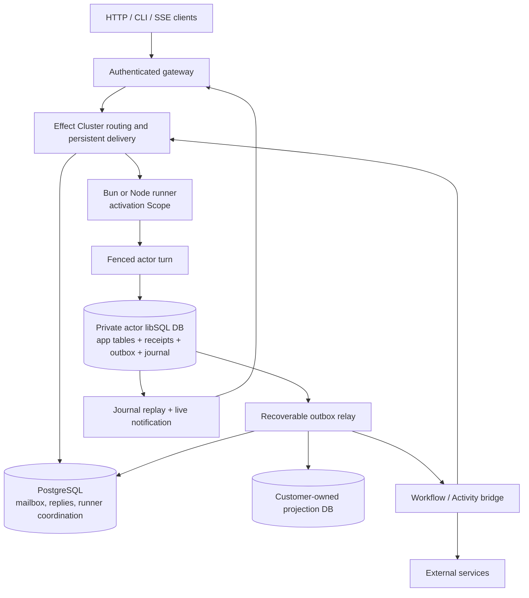

# System architecture

Research date: 2026-09-17. Status: design specification, not implemented runtime behavior.

## Two independent durable databases

The standard deployment combines a PostgreSQL-backed Cluster/control plane with private actor databases served through a tested libSQL-compatible provider. This is intentionally not one distributed transaction. The local actor database is the authority for a committed command; PostgreSQL is the durable delivery and routing system. The framework must reconcile the two.

## Durable command path

A gateway authenticates the caller and resolves an application/environment/type/id address. It durably submits an encoded command with an idempotency key. Cluster's persisted-message path is explicitly enabled; a default volatile RPC is not sufficient. A runner acquires the actor activation, installs/validates the actor database fence and runs only a compatible code/schema version.

Within the actor DB transaction it checks the command receipt. If present, the original outcome is used. Otherwise it executes the local mutation, records the result and stages outgoing intents. The transaction commits before a durable reply can claim success. A relay transfers the committed intents into recoverable PostgreSQL work records and delivery envelopes; the PostgreSQL inbound reply/ack is completed afterward. A crash in between causes replay, not a second domain mutation.

The replay protocol must also make local outboxes discoverable after an actor sleeps. The preferred design registers relay work durably in PostgreSQL before retiring the inbound work that caused it. Clearing a relay task must be conditional on its current high-water target so a concurrent new commit is not forgotten. A periodic catalog reconciliation is a safety net, not a million-database hot polling loop.

## Services and scopes

Process-scoped: cluster transport, control SQL pool, telemetry exporter, validated application registry.

Activation-scoped: actor address, database client, fence, version metadata and repositories that capture that database. Do not memoize an activation-scoped Layer across unrelated identities.

Turn-scoped: transaction connection, command identity, authorized principal, reply/result accumulator, staged intent writer. Client disconnection does not automatically cancel accepted durable work.

Work-scoped: external activity capability, provider credentials, attempt ID and cancellation handle. A workflow execution may continue outside an actor activation.

## Deployment roles

Gateway, runner and relay can initially ship in one trusted application image with separate entrypoints. Scale them separately only when workload evidence demands it. Railway is the initial deployment platform, not a required runtime API. In particular, a load-balanced service URL cannot stand in for a unique runner address. Verify stable reachable per-replica routing or use a topology with explicitly addressable runners.

PlanetScale's direct PostgreSQL endpoint is used for session-sensitive runner locks. A separate pooled endpoint may serve ordinary queries if its transaction semantics are tested. Each role gets an explicitly named SQL service; do not merge multiple `SqlClient` Layers and hope the intended client is selected.

## What stays out

No native storage engine, no global multi-region actor migration, no distributed SQL join across private databases, no shared process for mutually untrusted customers, and no arbitrary incremental multi-source view compiler in the initial release.

## Sources and evidence

- [E02: Effect Cluster entity example](https://github.com/Effect-TS/effect/blob/9ad9891e24058065bcd445772e005f8ce4b3e42f/ai-docs/src/80_cluster/10_entities.ts) — Messages are volatile unless persisted annotation is set; sequential handlers by default; activation-local Ref; maxIdleTime; typed clients.
- [E03: SQL runner ownership](https://github.com/Effect-TS/effect/blob/9ad9891e24058065bcd445772e005f8ce4b3e42f/packages/effect/src/unstable/cluster/SqlRunnerStorage.ts) — Reserved/rebuildable PostgreSQL connection and advisory lock behavior; assess current hardening, not an old issue headline.
- [E04: Cluster message persistence contract](https://github.com/Effect-TS/effect/blob/9ad9891e24058065bcd445772e005f8ce4b3e42f/packages/effect/src/unstable/cluster/MessageStorage.ts) — Shard-wide recovery queries, deduplication, replies and transaction wrapper; no cross-database transaction guarantee.
- [E09: Effect SQL client](https://github.com/Effect-TS/effect/blob/9ad9891e24058065bcd445772e005f8ce4b3e42f/packages/effect/src/unstable/sql/SqlClient.ts) — Transaction and reserved-connection API reference; bind each database role independently.
- [T01: libSQL versus Turso Database](https://docs.turso.tech/libsql) — The maintained SQLite fork and newer Rust rewrite are different engine/driver compatibility targets.
- [P01: PlanetScale PostgreSQL pooling](https://planetscale.com/docs/postgres/connecting/pgbouncer) — Transaction pool on port 6432; session-sensitive locks require suitable direct/session connection.
- [D02: Railway private networking](https://docs.railway.com/guides/private-networking) — Must validate per-replica identity/routing, not use one load-balanced address as runner identity.
