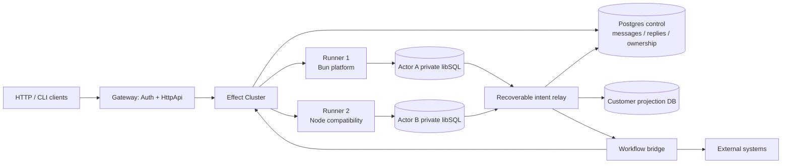
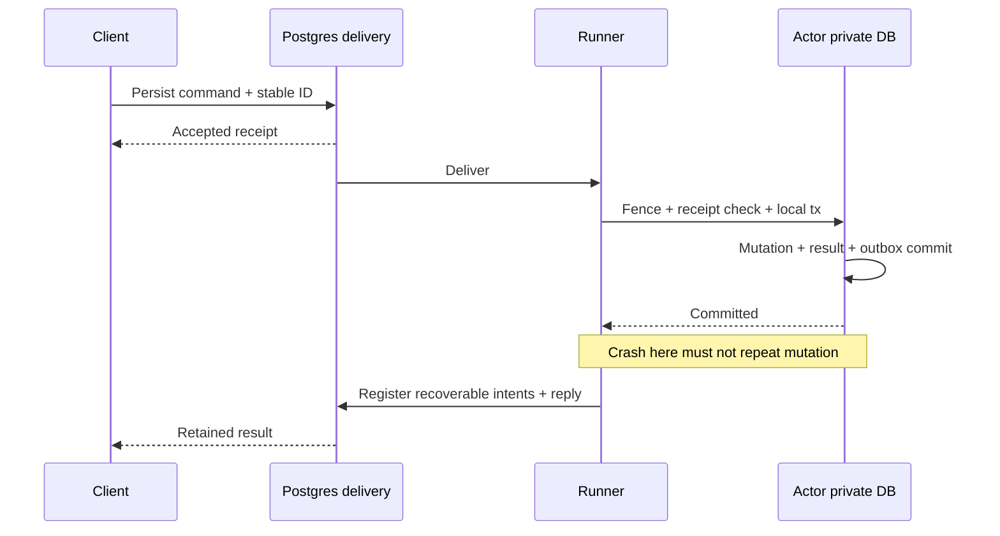
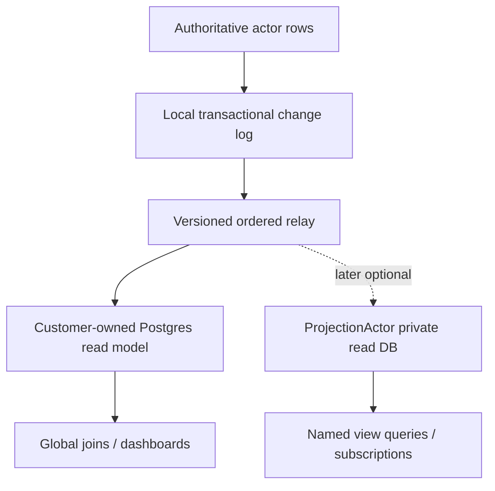
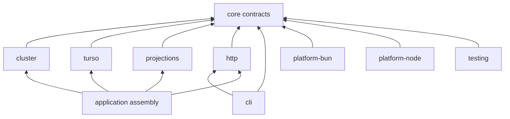

# System diagrams

Research date: 2026-09-17. Status: design specification, not implemented runtime behavior.

## Runtime and storage roles



## Commit and recovery sequence



## Projection authority



The optional target actor does not need PostgreSQL as a mandatory intermediary. PostgreSQL-derived multi-source views are a separate feature, not implied by single-source projection routing.

## Package boundary



## Scope lifetime

```
logical actor identity:  -------------------------------------------->
activation A:           [ Scope + DB client + cache ]
activation B:                                         [ Scope ... ]
durable DB:             =============================================>
external workflow:                 [ named durable work ------------> ]
```

A diagram box is a responsibility boundary, not necessarily a separate microservice. Keep deployment roles together until operational evidence warrants splitting them.

## Sources and evidence

- [E02: Effect Cluster entity example](https://github.com/Effect-TS/effect/blob/9ad9891e24058065bcd445772e005f8ce4b3e42f/ai-docs/src/80_cluster/10_entities.ts) — Messages are volatile unless persisted annotation is set; sequential handlers by default; activation-local Ref; maxIdleTime; typed clients.
- [E04: Cluster message persistence contract](https://github.com/Effect-TS/effect/blob/9ad9891e24058065bcd445772e005f8ce4b3e42f/packages/effect/src/unstable/cluster/MessageStorage.ts) — Shard-wide recovery queries, deduplication, replies and transaction wrapper; no cross-database transaction guarantee.
- [E05: Workflow Activity](https://github.com/Effect-TS/effect/blob/9ad9891e24058065bcd445772e005f8ce4b3e42f/packages/effect/src/unstable/workflow/Activity.ts) — Activity requires WorkflowEngine/WorkflowInstance. Only completed activity results memoized; replay can repeat external effects.
